# ATLAS — Códigos PlantUML

Cada bloco contém um diagrama completo. Para renderizar um diagrama separadamente, copie de `@startuml` a `@enduml` para um arquivo `.puml`. O comando de renderização está no [índice da modelagem](README.md#renderização).

## 01 · Domínio Java em memória

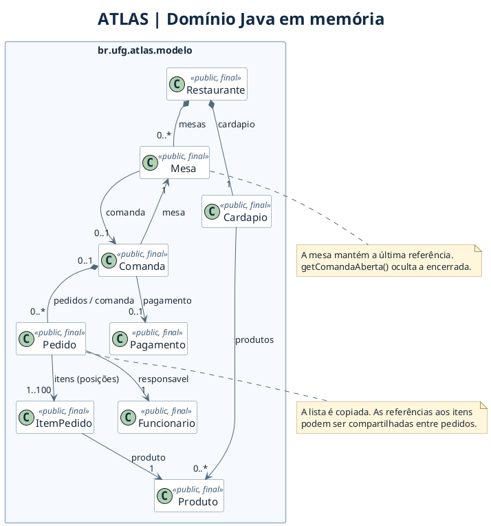
```plantuml
@startuml
title ATLAS | Domínio Java em memória
skinparam backgroundColor #FFFFFF
skinparam defaultFontName Arial
skinparam defaultFontColor #17283A
skinparam titleFontColor #112B46
skinparam titleFontSize 24
skinparam shadowing false
skinparam ArrowColor #51687E
skinparam packageStyle rectangle
skinparam packageBackgroundColor #F6F9FD
skinparam packageBorderColor #9AAFC7
skinparam classBackgroundColor #FFFFFF
skinparam classBorderColor #547693
skinparam classAttributeFontSize 13
skinparam classFontSize 15
skinparam classAttributeIconSize 0
skinparam classStereotypeFontColor #405C77
skinparam noteBackgroundColor #FFF6DB
skinparam noteBorderColor #AF9055
skinparam nodesep 34
skinparam ranksep 48
set separator none
hide empty members

package "br.ufg.atlas.modelo" {
  ' Modelo/src/main/java/br/ufg/atlas/modelo/Restaurante.java:5
  class "Restaurante" as J_modelo_Restaurante <<public, final>>

  ' Modelo/src/main/java/br/ufg/atlas/modelo/Mesa.java:3
  class "Mesa" as J_modelo_Mesa <<public, final>>

  ' Modelo/src/main/java/br/ufg/atlas/modelo/Cardapio.java:6
  class "Cardapio" as J_modelo_Cardapio <<public, final>>

  ' Modelo/src/main/java/br/ufg/atlas/modelo/Comanda.java:6
  class "Comanda" as J_modelo_Comanda <<public, final>>

  ' Modelo/src/main/java/br/ufg/atlas/modelo/Pedido.java:6
  class "Pedido" as J_modelo_Pedido <<public, final>>

  ' Modelo/src/main/java/br/ufg/atlas/modelo/Pagamento.java:3
  class "Pagamento" as J_modelo_Pagamento <<public, final>>

  ' Modelo/src/main/java/br/ufg/atlas/modelo/ItemPedido.java:3
  class "ItemPedido" as J_modelo_ItemPedido <<public, final>>

  ' Modelo/src/main/java/br/ufg/atlas/modelo/Funcionario.java:3
  class "Funcionario" as J_modelo_Funcionario <<public, final>>

  ' Modelo/src/main/java/br/ufg/atlas/modelo/Produto.java:3
  class "Produto" as J_modelo_Produto <<public, final>>
}

J_modelo_Restaurante *-- "0..*" J_modelo_Mesa : mesas
J_modelo_Restaurante *-- "1" J_modelo_Cardapio : cardapio
J_modelo_Mesa --> "0..1" J_modelo_Comanda : comanda
J_modelo_Comanda --> "1" J_modelo_Mesa : mesa
J_modelo_Comanda "0..1" *-- "0..*" J_modelo_Pedido : pedidos / comanda
J_modelo_Comanda --> "0..1" J_modelo_Pagamento : pagamento
J_modelo_Pedido --> "1..100" J_modelo_ItemPedido : itens (posições)
J_modelo_Pedido --> "1" J_modelo_Funcionario : responsavel
J_modelo_ItemPedido --> "1" J_modelo_Produto : produto
J_modelo_Cardapio --> "0..*" J_modelo_Produto : produtos

note bottom of J_modelo_Mesa
  A mesa mantém a última referência.
  getComandaAberta() oculta a encerrada.
end note
note bottom of J_modelo_Pedido
  A lista é copiada. As referências aos itens
  podem ser compartilhadas entre pedidos.
end note
@enduml
```

## 02 · Classes do Modelo · atendimento e conta

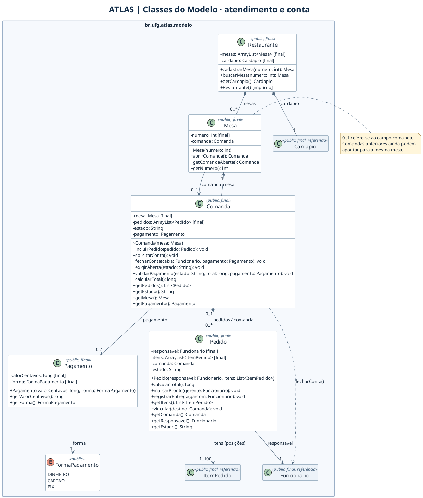
```plantuml
@startuml
title ATLAS | Classes do Modelo · atendimento e conta
skinparam backgroundColor #FFFFFF
skinparam defaultFontName Arial
skinparam defaultFontColor #17283A
skinparam titleFontColor #112B46
skinparam titleFontSize 24
skinparam shadowing false
skinparam ArrowColor #51687E
skinparam packageStyle rectangle
skinparam packageBackgroundColor #F6F9FD
skinparam packageBorderColor #9AAFC7
skinparam classBackgroundColor #FFFFFF
skinparam classBorderColor #547693
skinparam classAttributeFontSize 13
skinparam classFontSize 15
skinparam classAttributeIconSize 0
skinparam classStereotypeFontColor #405C77
skinparam noteBackgroundColor #FFF6DB
skinparam noteBorderColor #AF9055
skinparam nodesep 34
skinparam ranksep 48
set separator none
hide empty members

package "br.ufg.atlas.modelo" {
  ' Modelo/src/main/java/br/ufg/atlas/modelo/Restaurante.java:5
  class "Restaurante" as J_modelo_Restaurante <<public, final>> {
    ' linha 6
    {field} -mesas: ArrayList<Mesa> [final]
    ' linha 7
    {field} -cardapio: Cardapio [final]
    ' linha 9
    {method} +cadastrarMesa(numero: int): Mesa
    ' linha 16
    {method} +buscarMesa(numero: int): Mesa
    ' linha 23
    {method} +getCardapio(): Cardapio
    ' linha 5
    {method} +Restaurante() [implícito]
  }

  ' Modelo/src/main/java/br/ufg/atlas/modelo/Mesa.java:3
  class "Mesa" as J_modelo_Mesa <<public, final>> {
    ' linha 4
    {field} -numero: int [final]
    ' linha 5
    {field} -comanda: Comanda
    ' linha 7
    {method} +Mesa(numero: int)
    ' linha 12
    {method} +abrirComanda(): Comanda
    ' linha 17
    {method} +getComandaAberta(): Comanda
    ' linha 22
    {method} +getNumero(): int
  }

  ' Modelo/src/main/java/br/ufg/atlas/modelo/Comanda.java:6
  class "Comanda" as J_modelo_Comanda <<public, final>> {
    ' linha 7
    {field} -mesa: Mesa [final]
    ' linha 8
    {field} -pedidos: ArrayList<Pedido> [final]
    ' linha 9
    {field} -estado: String
    ' linha 10
    {field} -pagamento: Pagamento
    ' linha 12
    {method} ~Comanda(mesa: Mesa)
    ' linha 14
    {method} +incluirPedido(pedido: Pedido): void
    ' linha 21
    {method} +solicitarConta(): void
    ' linha 26
    {method} +fecharConta(caixa: Funcionario, pagamento: Pagamento): void
    ' linha 35
    {method} {static} +exigirAberta(estado: String): void
    ' linha 39
    {method} {static} +validarPagamento(estado: String, total: long, pagamento: Pagamento): void
    ' linha 48
    {method} +calcularTotal(): long
    ' linha 54
    {method} +getPedidos(): List<Pedido>
    ' linha 55
    {method} +getEstado(): String
    ' linha 56
    {method} +getMesa(): Mesa
    ' linha 57
    {method} +getPagamento(): Pagamento
  }

  ' Modelo/src/main/java/br/ufg/atlas/modelo/Pedido.java:6
  class "Pedido" as J_modelo_Pedido <<public, final>> {
    ' linha 7
    {field} -responsavel: Funcionario [final]
    ' linha 8
    {field} -itens: ArrayList<ItemPedido> [final]
    ' linha 9
    {field} -comanda: Comanda
    ' linha 10
    {field} -estado: String
    ' linha 12
    {method} +Pedido(responsavel: Funcionario, itens: List<ItemPedido>)
    ' linha 26
    {method} +calcularTotal(): long
    ' linha 34
    {method} +marcarPronto(gerente: Funcionario): void
    ' linha 44
    {method} +registrarEntrega(garcom: Funcionario): void
    ' linha 54
    {method} +getItens(): List<ItemPedido>
    ' linha 56
    {method} ~vincular(destino: Comanda): void
    ' linha 61
    {method} +getComanda(): Comanda
    ' linha 62
    {method} +getResponsavel(): Funcionario
    ' linha 63
    {method} +getEstado(): String
  }

  ' Modelo/src/main/java/br/ufg/atlas/modelo/Pagamento.java:3
  class "Pagamento" as J_modelo_Pagamento <<public, final>> {
    ' linha 4
    {field} -valorCentavos: long [final]
    ' linha 5
    {field} -forma: FormaPagamento [final]
    ' linha 7
    {method} +Pagamento(valorCentavos: long, forma: FormaPagamento)
    ' linha 15
    {method} +getValorCentavos(): long
    ' linha 16
    {method} +getForma(): FormaPagamento
  }

  ' Modelo/src/main/java/br/ufg/atlas/modelo/FormaPagamento.java:3
  enum "FormaPagamento" as J_modelo_FormaPagamento <<public>> {
    ' linha 4
    DINHEIRO
    ' linha 4
    CARTAO
    ' linha 4
    PIX
  }

  ' Modelo/src/main/java/br/ufg/atlas/modelo/Cardapio.java:6
  class "Cardapio" as J_modelo_Cardapio <<public, final, referência>> #EDF3F9

  ' Modelo/src/main/java/br/ufg/atlas/modelo/ItemPedido.java:3
  class "ItemPedido" as J_modelo_ItemPedido <<public, final, referência>> #EDF3F9

  ' Modelo/src/main/java/br/ufg/atlas/modelo/Funcionario.java:3
  class "Funcionario" as J_modelo_Funcionario <<public, final, referência>> #EDF3F9
}

J_modelo_Restaurante *-- "0..*" J_modelo_Mesa : mesas
J_modelo_Restaurante *-- "1" J_modelo_Cardapio : cardapio
J_modelo_Mesa --> "0..1" J_modelo_Comanda : comanda
J_modelo_Comanda --> "1" J_modelo_Mesa : mesa
J_modelo_Comanda "0..1" *-- "0..*" J_modelo_Pedido : pedidos / comanda
J_modelo_Comanda --> "0..1" J_modelo_Pagamento : pagamento
J_modelo_Pedido --> "1..100" J_modelo_ItemPedido : itens (posições)
J_modelo_Pedido --> "1" J_modelo_Funcionario : responsavel
J_modelo_Pagamento --> "1" J_modelo_FormaPagamento : forma
J_modelo_Comanda ..> J_modelo_Funcionario : fecharConta()

note right of J_modelo_Mesa
  0..1 refere-se ao campo comanda.
  Comandas anteriores ainda podem
  apontar para a mesma mesa.
end note
@enduml
```

## 03 · Classes do Modelo · catálogo, item e funcionário

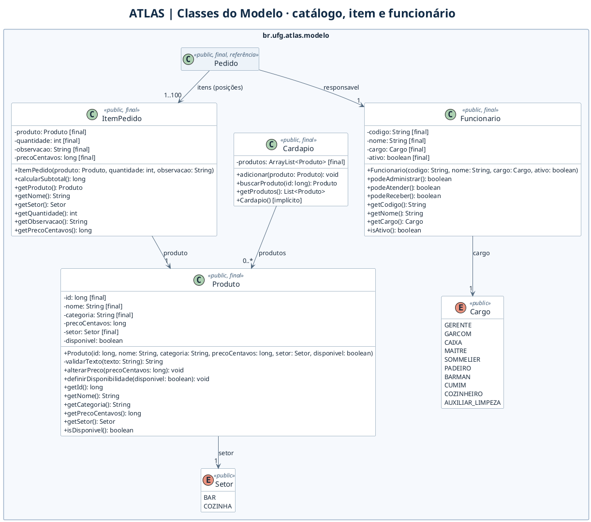
```plantuml
@startuml
title ATLAS | Classes do Modelo · catálogo, item e funcionário
skinparam backgroundColor #FFFFFF
skinparam defaultFontName Arial
skinparam defaultFontColor #17283A
skinparam titleFontColor #112B46
skinparam titleFontSize 24
skinparam shadowing false
skinparam ArrowColor #51687E
skinparam packageStyle rectangle
skinparam packageBackgroundColor #F6F9FD
skinparam packageBorderColor #9AAFC7
skinparam classBackgroundColor #FFFFFF
skinparam classBorderColor #547693
skinparam classAttributeFontSize 13
skinparam classFontSize 15
skinparam classAttributeIconSize 0
skinparam classStereotypeFontColor #405C77
skinparam noteBackgroundColor #FFF6DB
skinparam noteBorderColor #AF9055
skinparam nodesep 34
skinparam ranksep 48
set separator none
hide empty members

package "br.ufg.atlas.modelo" {
  ' Modelo/src/main/java/br/ufg/atlas/modelo/Cardapio.java:6
  class "Cardapio" as J_modelo_Cardapio <<public, final>> {
    ' linha 7
    {field} -produtos: ArrayList<Produto> [final]
    ' linha 9
    {method} +adicionar(produto: Produto): void
    ' linha 16
    {method} +buscarProduto(id: long): Produto
    ' linha 23
    {method} +getProdutos(): List<Produto>
    ' linha 6
    {method} +Cardapio() [implícito]
  }

  ' Modelo/src/main/java/br/ufg/atlas/modelo/Produto.java:3
  class "Produto" as J_modelo_Produto <<public, final>> {
    ' linha 4
    {field} -id: long [final]
    ' linha 5
    {field} -nome: String [final]
    ' linha 6
    {field} -categoria: String [final]
    ' linha 7
    {field} -precoCentavos: long
    ' linha 8
    {field} -setor: Setor [final]
    ' linha 9
    {field} -disponivel: boolean
    ' linha 11
    {method} +Produto(id: long, nome: String, categoria: String, precoCentavos: long, setor: Setor, disponivel: boolean)
    ' linha 23
    {method} -validarTexto(texto: String): String
    ' linha 30
    {method} +alterarPreco(precoCentavos: long): void
    ' linha 37
    {method} +definirDisponibilidade(disponivel: boolean): void
    ' linha 38
    {method} +getId(): long
    ' linha 39
    {method} +getNome(): String
    ' linha 40
    {method} +getCategoria(): String
    ' linha 41
    {method} +getPrecoCentavos(): long
    ' linha 42
    {method} +getSetor(): Setor
    ' linha 43
    {method} +isDisponivel(): boolean
  }

  ' Modelo/src/main/java/br/ufg/atlas/modelo/Setor.java:3
  enum "Setor" as J_modelo_Setor <<public>> {
    ' linha 4
    BAR
    ' linha 4
    COZINHA
  }

  ' Modelo/src/main/java/br/ufg/atlas/modelo/ItemPedido.java:3
  class "ItemPedido" as J_modelo_ItemPedido <<public, final>> {
    ' linha 4
    {field} -produto: Produto [final]
    ' linha 5
    {field} -quantidade: int [final]
    ' linha 6
    {field} -observacao: String [final]
    ' linha 7
    {field} -precoCentavos: long [final]
    ' linha 9
    {method} +ItemPedido(produto: Produto, quantidade: int, observacao: String)
    ' linha 25
    {method} +calcularSubtotal(): long
    ' linha 26
    {method} +getProduto(): Produto
    ' linha 27
    {method} +getNome(): String
    ' linha 28
    {method} +getSetor(): Setor
    ' linha 29
    {method} +getQuantidade(): int
    ' linha 30
    {method} +getObservacao(): String
    ' linha 31
    {method} +getPrecoCentavos(): long
  }

  ' Modelo/src/main/java/br/ufg/atlas/modelo/Funcionario.java:3
  class "Funcionario" as J_modelo_Funcionario <<public, final>> {
    ' linha 4
    {field} -codigo: String [final]
    ' linha 5
    {field} -nome: String [final]
    ' linha 6
    {field} -cargo: Cargo [final]
    ' linha 7
    {field} -ativo: boolean [final]
    ' linha 9
    {method} +Funcionario(codigo: String, nome: String, cargo: Cargo, ativo: boolean)
    ' linha 22
    {method} +podeAdministrar(): boolean
    ' linha 23
    {method} +podeAtender(): boolean
    ' linha 24
    {method} +podeReceber(): boolean
    ' linha 25
    {method} +getCodigo(): String
    ' linha 26
    {method} +getNome(): String
    ' linha 27
    {method} +getCargo(): Cargo
    ' linha 28
    {method} +isAtivo(): boolean
  }

  ' Modelo/src/main/java/br/ufg/atlas/modelo/Cargo.java:3
  enum "Cargo" as J_modelo_Cargo <<public>> {
    ' linha 4
    GERENTE
    ' linha 4
    GARCOM
    ' linha 4
    CAIXA
    ' linha 4
    MAITRE
    ' linha 4
    SOMMELIER
    ' linha 4
    PADEIRO
    ' linha 4
    BARMAN
    ' linha 4
    CUMIM
    ' linha 4
    COZINHEIRO
    ' linha 4
    AUXILIAR_LIMPEZA
  }

  ' Modelo/src/main/java/br/ufg/atlas/modelo/Pedido.java:6
  class "Pedido" as J_modelo_Pedido <<public, final, referência>> #EDF3F9
}

J_modelo_Cardapio --> "0..*" J_modelo_Produto : produtos
J_modelo_ItemPedido --> "1" J_modelo_Produto : produto
J_modelo_Produto --> "1" J_modelo_Setor : setor
J_modelo_Funcionario --> "1" J_modelo_Cargo : cargo
J_modelo_Pedido --> "1..100" J_modelo_ItemPedido : itens (posições)
J_modelo_Pedido --> "1" J_modelo_Funcionario : responsavel
@enduml
```

## 04 · Classes do Backend · inicialização, HTTP e MQTT

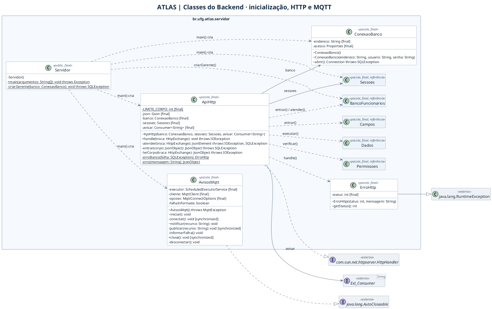
```plantuml
@startuml
title ATLAS | Classes do Backend · inicialização, HTTP e MQTT
skinparam backgroundColor #FFFFFF
skinparam defaultFontName Arial
skinparam defaultFontColor #17283A
skinparam titleFontColor #112B46
skinparam titleFontSize 24
skinparam shadowing false
skinparam ArrowColor #51687E
skinparam packageStyle rectangle
skinparam packageBackgroundColor #F6F9FD
skinparam packageBorderColor #9AAFC7
skinparam classBackgroundColor #FFFFFF
skinparam classBorderColor #547693
skinparam classAttributeFontSize 13
skinparam classFontSize 15
skinparam classAttributeIconSize 0
skinparam classStereotypeFontColor #405C77
skinparam noteBackgroundColor #FFF6DB
skinparam noteBorderColor #AF9055
skinparam nodesep 34
skinparam ranksep 48
set separator none
hide empty members
left to right direction

package "br.ufg.atlas.servidor" {
  ' Backend/src/main/java/br/ufg/atlas/servidor/Servidor.java:13
  class "Servidor" as J_servidor_Servidor <<public, final>> {
    ' linha 14
    {method} -Servidor()
    ' linha 16
    {method} {static} +main(argumentos: String[]): void throws Exception
    ' linha 42
    {method} {static} -criarGerente(banco: ConexaoBanco): void throws SQLException
  }

  ' Backend/src/main/java/br/ufg/atlas/servidor/ApiHttp.java:18
  class "ApiHttp" as J_servidor_ApiHttp <<pacote, final>> {
    ' linha 19
    {field} {static} -LIMITE_CORPO: int [final]
    ' linha 20
    {field} -json: Gson [final]
    ' linha 21
    {field} -banco: ConexaoBanco [final]
    ' linha 22
    {field} -sessoes: Sessoes [final]
    ' linha 23
    {field} -avisar: Consumer<String> [final]
    ' linha 25
    {method} ~ApiHttp(banco: ConexaoBanco, sessoes: Sessoes, avisar: Consumer<String>)
    ' linha 31
    {method} +handle(troca: HttpExchange): void throws IOException
    ' linha 68
    {method} -atender(troca: HttpExchange): JsonElement throws IOException, SQLException
    ' linha 106
    {method} -entrar(corpo: JsonObject): JsonObject throws SQLException
    ' linha 124
    {method} -lerCorpo(troca: HttpExchange): JsonObject throws IOException
    ' linha 133
    {method} {static} -erroBanco(falha: SQLException): ErroHttp
    ' linha 143
    {method} {static} -erro(mensagem: String): JsonObject
  }

  ' Backend/src/main/java/br/ufg/atlas/servidor/AvisosMqtt.java:14
  class "AvisosMqtt" as J_servidor_AvisosMqtt <<pacote, final>> {
    ' linha 15
    {field} -executor: ScheduledExecutorService [final]
    ' linha 16
    {field} -cliente: MqttClient [final]
    ' linha 17
    {field} -opcoes: MqttConnectOptions [final]
    ' linha 18
    {field} -falhaInformada: boolean
    ' linha 20
    {method} ~AvisosMqtt() throws MqttException
    ' linha 32
    {method} ~iniciar(): void
    ' linha 36
    {method} -conectar(): void [synchronized]
    ' linha 48
    {method} ~notificar(recurso: String): void
    ' linha 57
    {method} -publicar(recurso: String): void [synchronized]
    ' linha 67
    {method} -informarFalha(): void
    ' linha 72
    {method} +close(): void [synchronized]
    ' linha 83
    {method} -desconectar(): void
  }

  ' Backend/src/main/java/br/ufg/atlas/servidor/ConexaoBanco.java:8
  class "ConexaoBanco" as J_servidor_ConexaoBanco <<pacote, final>> {
    ' linha 18
    {field} -endereco: String [final]
    ' linha 19
    {field} -acesso: Properties [final]
    ' linha 21
    {method} ~ConexaoBanco()
    ' linha 26
    {method} ~ConexaoBanco(endereco: String, usuario: String, senha: String)
    ' linha 34
    {method} ~abrir(): Connection throws SQLException
  }

  ' Backend/src/main/java/br/ufg/atlas/servidor/ErroHttp.java:3
  class "ErroHttp" as J_servidor_ErroHttp <<pacote, final>> {
    ' linha 4
    {field} -status: int [final]
    ' linha 6
    {method} ~ErroHttp(status: int, mensagem: String)
    ' linha 11
    {method} ~getStatus(): int
  }

  ' Backend/src/main/java/br/ufg/atlas/servidor/Sessoes.java:9
  class "Sessoes" as J_servidor_Sessoes <<pacote, final, referência>> #EDF3F9

  ' Backend/src/main/java/br/ufg/atlas/servidor/Permissoes.java:5
  class "Permissoes" as J_servidor_Permissoes <<pacote, final, referência>> #EDF3F9

  ' Backend/src/main/java/br/ufg/atlas/servidor/Dados.java:11
  class "Dados" as J_servidor_Dados <<pacote, final, referência>> #EDF3F9

  ' Backend/src/main/java/br/ufg/atlas/servidor/BancoFuncionarios.java:10
  class "BancoFuncionarios" as J_servidor_BancoFuncionarios <<pacote, final, referência>> #EDF3F9

  ' Backend/src/main/java/br/ufg/atlas/servidor/Campos.java:7
  class "Campos" as J_servidor_Campos <<pacote, final, referência>> #EDF3F9
}

interface "com.sun.net.httpserver.HttpHandler" as Ext_HttpHandler <<externo>> #EEF1F5

interface "java.lang.AutoCloseable" as Ext_AutoCloseable <<externo>> #EEF1F5

class "java.lang.RuntimeException" as Ext_RuntimeException <<externo>> #EEF1F5

J_servidor_ApiHttp ..|> Ext_HttpHandler
J_servidor_AvisosMqtt ..|> Ext_AutoCloseable
J_servidor_ErroHttp --|> Ext_RuntimeException
J_servidor_Servidor ..> J_servidor_ApiHttp : main() cria
J_servidor_Servidor ..> J_servidor_AvisosMqtt : main() cria
J_servidor_Servidor ..> J_servidor_Sessoes : main() cria
J_servidor_Servidor ..> J_servidor_ConexaoBanco : main() cria
J_servidor_Servidor ..> J_servidor_BancoFuncionarios : criarGerente()
J_servidor_ApiHttp --> J_servidor_ConexaoBanco : banco
J_servidor_ApiHttp --> J_servidor_Sessoes : sessoes
J_servidor_ApiHttp --> Ext_Consumer : avisar
interface "java.util.function.Consumer<String>" as Ext_Consumer <<externo>> #EEF1F5
J_servidor_ApiHttp ..> J_servidor_ErroHttp : handle()
J_servidor_ApiHttp ..> J_servidor_Dados : executar()
J_servidor_ApiHttp ..> J_servidor_Campos : entrar()
J_servidor_ApiHttp ..> J_servidor_BancoFuncionarios : entrar() / atender()
J_servidor_ApiHttp ..> J_servidor_Permissoes : verificar()
@enduml
```

## 05 · Classes do Backend · sessão, credenciais e autorização

```plantuml
@startuml
title ATLAS | Classes do Backend · sessão, credenciais e autorização
skinparam backgroundColor #FFFFFF
skinparam defaultFontName Arial
skinparam defaultFontColor #17283A
skinparam titleFontColor #112B46
skinparam titleFontSize 24
skinparam shadowing false
skinparam ArrowColor #51687E
skinparam packageStyle rectangle
skinparam packageBackgroundColor #F6F9FD
skinparam packageBorderColor #9AAFC7
skinparam classBackgroundColor #FFFFFF
skinparam classBorderColor #547693
skinparam classAttributeFontSize 13
skinparam classFontSize 15
skinparam classAttributeIconSize 0
skinparam classStereotypeFontColor #405C77
skinparam noteBackgroundColor #FFF6DB
skinparam noteBorderColor #AF9055
skinparam nodesep 34
skinparam ranksep 48
set separator none
hide empty members
left to right direction

package "br.ufg.atlas.servidor" {
  ' Backend/src/main/java/br/ufg/atlas/servidor/Sessoes.java:9
  class "Sessoes" as J_servidor_Sessoes <<pacote, final>> {
    ' linha 11
    {field} -sessoes: Map<String, Sessao> [final]
    ' linha 12
    {field} -relogio: Clock [final]
    ' linha 14
    {method} ~Sessoes(relogio: Clock)
    ' linha 16
    {method} ~abrir(codigo: String): String [synchronized]
    ' linha 24
    {method} ~identificar(token: String): String [synchronized]
    ' linha 33
    {method} ~encerrar(token: String): void [synchronized]
    ' linha 35
    {method} ~revogar(codigo: String): void [synchronized]
  }

  ' Backend/src/main/java/br/ufg/atlas/servidor/Sessoes.java:10
  class "Sessoes.Sessao" as J_servidor_Sessoes_Sessao <<private, record, static, final>> {
    ' linha 10
    codigo: String [componente]
    ' linha 10
    validade: long [componente]
  }

  ' Backend/src/main/java/br/ufg/atlas/servidor/Permissoes.java:5
  class "Permissoes" as J_servidor_Permissoes <<pacote, final>> {
    ' linha 6
    {method} -Permissoes()
    ' linha 8
    {method} {static} ~verificar(pessoa: Funcionario, metodo: String, partes: String[]): void
  }

  ' Backend/src/main/java/br/ufg/atlas/servidor/Senhas.java:11
  class "Senhas" as J_servidor_Senhas <<pacote, final>> {
    ' linha 12
    {field} {static} -ITERACOES: int [final]
    ' linha 13
    {field} {static} -ALEATORIO: SecureRandom [final]
    ' linha 15
    {method} -Senhas()
    ' linha 17
    {method} {static} ~gerar(senha: String): String
    ' linha 28
    {method} {static} ~conferir(senha: String, registro: String): boolean
    ' linha 43
    {method} {static} -derivar(senha: String, sal: byte[], iteracoes: int): byte[]
  }

  ' Backend/src/main/java/br/ufg/atlas/servidor/BancoFuncionarios.java:10
  class "BancoFuncionarios" as J_servidor_BancoFuncionarios <<pacote, final>> {
    ' linha 11
    {method} -BancoFuncionarios()
    ' linha 13
    {method} {static} ~autenticar(conexao: Connection, codigo: String, senha: String): Funcionario throws SQLException
    ' linha 21
    {method} {static} ~buscarAtivo(conexao: Connection, codigo: String): Funcionario throws SQLException
    ' linha 27
    {method} {static} -funcionario(linha: JsonObject): Funcionario
    ' linha 32
    {method} {static} ~criarPrimeiroGerente(conexao: Connection, codigo: String, nome: String, senha: String): void throws SQLException
    ' linha 47
    {method} {static} ~listar(conexao: Connection): JsonArray throws SQLException
    ' linha 52
    {method} {static} ~cadastrar(conexao: Connection, dados: JsonObject): JsonObject throws SQLException
    ' linha 60
    {method} {static} ~editar(conexao: Connection, codigo: String, dados: JsonObject): JsonObject throws SQLException
    ' linha 79
    {method} {static} -lerCadastro(codigo: String, dados: JsonObject): Funcionario
  }

  ' Backend/src/main/java/br/ufg/atlas/servidor/ErroHttp.java:3
  class "ErroHttp" as J_servidor_ErroHttp <<pacote, final, referência>> #EDF3F9

  ' Backend/src/main/java/br/ufg/atlas/servidor/Campos.java:7
  class "Campos" as J_servidor_Campos <<pacote, final, referência>> #EDF3F9

  ' Backend/src/main/java/br/ufg/atlas/servidor/Consultas.java:15
  class "Consultas" as J_servidor_Consultas <<pacote, final, referência>> #EDF3F9
}

package "br.ufg.atlas.modelo" {
  ' Modelo/src/main/java/br/ufg/atlas/modelo/Funcionario.java:3
  class "Funcionario" as J_modelo_Funcionario <<public, final, referência>> #EDF3F9

  ' Modelo/src/main/java/br/ufg/atlas/modelo/Cargo.java:3
  enum "Cargo" as J_modelo_Cargo <<public, referência>> #EDF3F9
}

J_servidor_Sessoes *-- "0..*" J_servidor_Sessoes_Sessao : sessoes (token → sessão)
J_servidor_Sessoes ..> J_servidor_ErroHttp : identificar()
J_servidor_Permissoes ..> J_servidor_ErroHttp : verificar()
J_servidor_Permissoes ..> J_modelo_Funcionario : verificar()
J_servidor_BancoFuncionarios ..> J_modelo_Funcionario : instancia
J_servidor_BancoFuncionarios ..> J_modelo_Cargo : valueOf()
J_servidor_BancoFuncionarios ..> J_servidor_Senhas : gera e confere hash
J_servidor_BancoFuncionarios ..> J_servidor_ErroHttp : criarPrimeiroGerente() / editar()
J_servidor_BancoFuncionarios ..> J_servidor_Campos : entrada
J_servidor_BancoFuncionarios ..> J_servidor_Consultas : JDBC

note right of J_servidor_Sessoes_Sessao
  Construtor canônico private Sessao(String, long)
  Acessores públicos codigo() e validade()
  são gerados pelo Java com o record.
end note
@enduml
```

## 06 · Classes do Backend · rotas, entrada e acesso JDBC

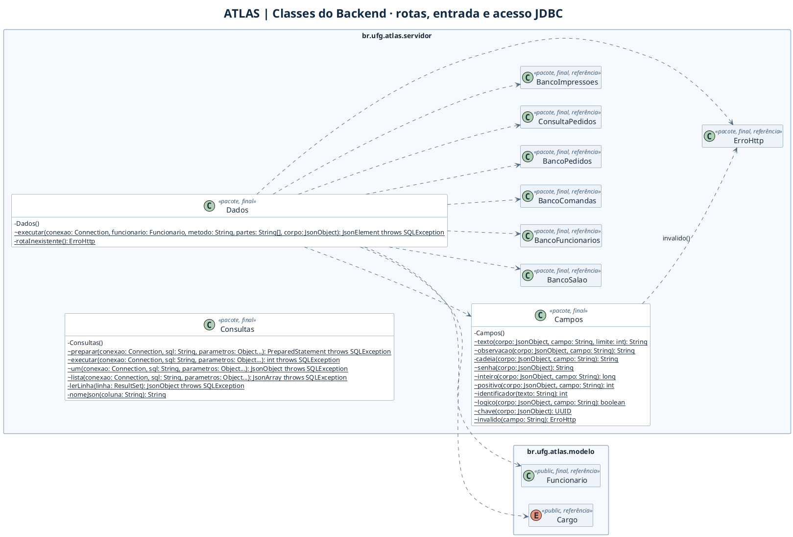
```plantuml
@startuml
title ATLAS | Classes do Backend · rotas, entrada e acesso JDBC
skinparam backgroundColor #FFFFFF
skinparam defaultFontName Arial
skinparam defaultFontColor #17283A
skinparam titleFontColor #112B46
skinparam titleFontSize 24
skinparam shadowing false
skinparam ArrowColor #51687E
skinparam packageStyle rectangle
skinparam packageBackgroundColor #F6F9FD
skinparam packageBorderColor #9AAFC7
skinparam classBackgroundColor #FFFFFF
skinparam classBorderColor #547693
skinparam classAttributeFontSize 13
skinparam classFontSize 15
skinparam classAttributeIconSize 0
skinparam classStereotypeFontColor #405C77
skinparam noteBackgroundColor #FFF6DB
skinparam noteBorderColor #AF9055
skinparam nodesep 34
skinparam ranksep 48
set separator none
hide empty members
left to right direction

package "br.ufg.atlas.servidor" {
  ' Backend/src/main/java/br/ufg/atlas/servidor/Dados.java:11
  class "Dados" as J_servidor_Dados <<pacote, final>> {
    ' linha 12
    {method} -Dados()
    ' linha 14
    {method} {static} ~executar(conexao: Connection, funcionario: Funcionario, metodo: String, partes: String[], corpo: JsonObject): JsonElement throws SQLException
    ' linha 61
    {method} {static} -rotaInexistente(): ErroHttp
  }

  ' Backend/src/main/java/br/ufg/atlas/servidor/Campos.java:7
  class "Campos" as J_servidor_Campos <<pacote, final>> {
    ' linha 8
    {method} -Campos()
    ' linha 10
    {method} {static} ~texto(corpo: JsonObject, campo: String, limite: int): String
    ' linha 18
    {method} {static} ~observacao(corpo: JsonObject, campo: String): String
    ' linha 25
    {method} {static} -cadeia(corpo: JsonObject, campo: String): String
    ' linha 35
    {method} {static} ~senha(corpo: JsonObject): String
    ' linha 42
    {method} {static} ~inteiro(corpo: JsonObject, campo: String): long
    ' linha 54
    {method} {static} ~positivo(corpo: JsonObject, campo: String): int
    ' linha 60
    {method} {static} ~identificador(texto: String): int
    ' linha 70
    {method} {static} ~logico(corpo: JsonObject, campo: String): boolean
    ' linha 78
    {method} {static} ~chave(corpo: JsonObject): UUID
    ' linha 89
    {method} {static} ~invalido(campo: String): ErroHttp
  }

  ' Backend/src/main/java/br/ufg/atlas/servidor/Consultas.java:15
  class "Consultas" as J_servidor_Consultas <<pacote, final>> {
    ' linha 16
    {method} -Consultas()
    ' linha 18
    {method} {static} ~preparar(conexao: Connection, sql: String, parametros: Object...): PreparedStatement throws SQLException
    ' linha 32
    {method} {static} ~executar(conexao: Connection, sql: String, parametros: Object...): int throws SQLException
    ' linha 38
    {method} {static} ~um(conexao: Connection, sql: String, parametros: Object...): JsonObject throws SQLException
    ' linha 48
    {method} {static} ~lista(conexao: Connection, sql: String, parametros: Object...): JsonArray throws SQLException
    ' linha 59
    {method} {static} -lerLinha(linha: ResultSet): JsonObject throws SQLException
    ' linha 81
    {method} {static} -nomeJson(coluna: String): String
  }

  ' Backend/src/main/java/br/ufg/atlas/servidor/BancoSalao.java:10
  class "BancoSalao" as J_servidor_BancoSalao <<pacote, final, referência>> #EDF3F9

  ' Backend/src/main/java/br/ufg/atlas/servidor/BancoFuncionarios.java:10
  class "BancoFuncionarios" as J_servidor_BancoFuncionarios <<pacote, final, referência>> #EDF3F9

  ' Backend/src/main/java/br/ufg/atlas/servidor/BancoComandas.java:13
  class "BancoComandas" as J_servidor_BancoComandas <<pacote, final, referência>> #EDF3F9

  ' Backend/src/main/java/br/ufg/atlas/servidor/BancoPedidos.java:16
  class "BancoPedidos" as J_servidor_BancoPedidos <<pacote, final, referência>> #EDF3F9

  ' Backend/src/main/java/br/ufg/atlas/servidor/ConsultaPedidos.java:13
  class "ConsultaPedidos" as J_servidor_ConsultaPedidos <<pacote, final, referência>> #EDF3F9

  ' Backend/src/main/java/br/ufg/atlas/servidor/BancoImpressoes.java:11
  class "BancoImpressoes" as J_servidor_BancoImpressoes <<pacote, final, referência>> #EDF3F9

  ' Backend/src/main/java/br/ufg/atlas/servidor/ErroHttp.java:3
  class "ErroHttp" as J_servidor_ErroHttp <<pacote, final, referência>> #EDF3F9
}

package "br.ufg.atlas.modelo" {
  ' Modelo/src/main/java/br/ufg/atlas/modelo/Funcionario.java:3
  class "Funcionario" as J_modelo_Funcionario <<public, final, referência>> #EDF3F9

  ' Modelo/src/main/java/br/ufg/atlas/modelo/Cargo.java:3
  enum "Cargo" as J_modelo_Cargo <<public, referência>> #EDF3F9
}

J_servidor_Dados ..> J_servidor_BancoSalao
J_servidor_Dados ..> J_servidor_BancoFuncionarios
J_servidor_Dados ..> J_servidor_BancoComandas
J_servidor_Dados ..> J_servidor_BancoPedidos
J_servidor_Dados ..> J_servidor_ConsultaPedidos
J_servidor_Dados ..> J_servidor_BancoImpressoes
J_servidor_Dados ..> J_servidor_Campos
J_servidor_Dados ..> J_servidor_ErroHttp
J_servidor_Dados ..> J_modelo_Funcionario
J_servidor_Dados ..> J_modelo_Cargo
J_servidor_Campos ..> J_servidor_ErroHttp : invalido()
@enduml
```

## 07 · Classes do Backend · salão, catálogo e comanda

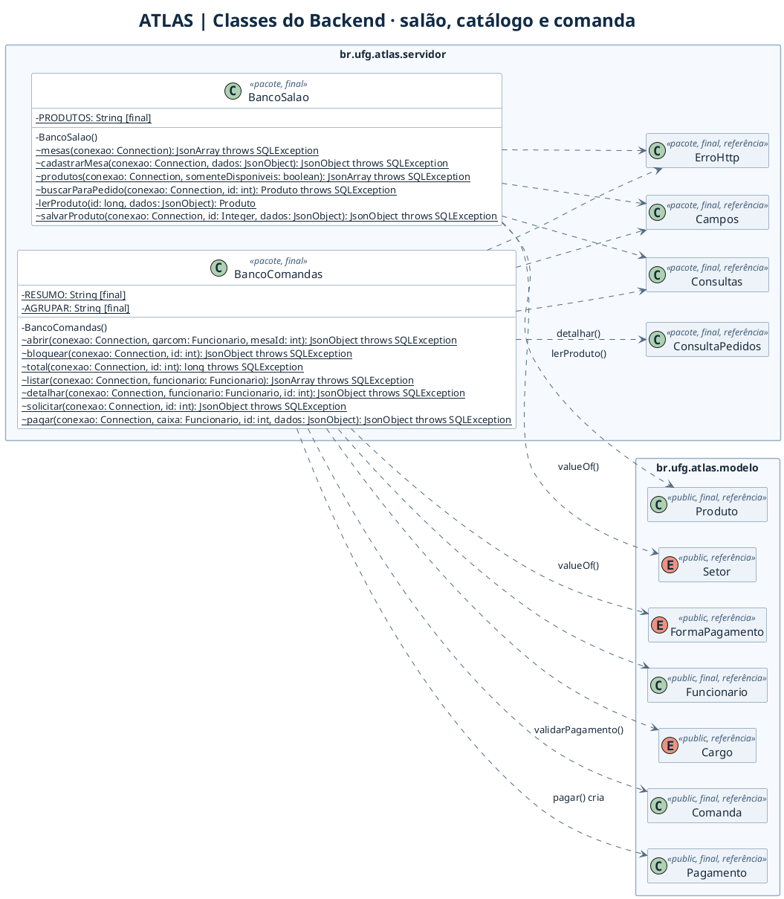
```plantuml
@startuml
title ATLAS | Classes do Backend · salão, catálogo e comanda
skinparam backgroundColor #FFFFFF
skinparam defaultFontName Arial
skinparam defaultFontColor #17283A
skinparam titleFontColor #112B46
skinparam titleFontSize 24
skinparam shadowing false
skinparam ArrowColor #51687E
skinparam packageStyle rectangle
skinparam packageBackgroundColor #F6F9FD
skinparam packageBorderColor #9AAFC7
skinparam classBackgroundColor #FFFFFF
skinparam classBorderColor #547693
skinparam classAttributeFontSize 13
skinparam classFontSize 15
skinparam classAttributeIconSize 0
skinparam classStereotypeFontColor #405C77
skinparam noteBackgroundColor #FFF6DB
skinparam noteBorderColor #AF9055
skinparam nodesep 34
skinparam ranksep 48
set separator none
hide empty members
left to right direction

package "br.ufg.atlas.servidor" {
  ' Backend/src/main/java/br/ufg/atlas/servidor/BancoSalao.java:10
  class "BancoSalao" as J_servidor_BancoSalao <<pacote, final>> {
    ' linha 11
    {field} {static} -PRODUTOS: String [final]
    ' linha 14
    {method} -BancoSalao()
    ' linha 16
    {method} {static} ~mesas(conexao: Connection): JsonArray throws SQLException
    ' linha 23
    {method} {static} ~cadastrarMesa(conexao: Connection, dados: JsonObject): JsonObject throws SQLException
    ' linha 28
    {method} {static} ~produtos(conexao: Connection, somenteDisponiveis: boolean): JsonArray throws SQLException
    ' linha 33
    {method} {static} ~buscarParaPedido(conexao: Connection, id: int): Produto throws SQLException
    ' linha 41
    {method} {static} -lerProduto(id: long, dados: JsonObject): Produto
    ' linha 52
    {method} {static} ~salvarProduto(conexao: Connection, id: Integer, dados: JsonObject): JsonObject throws SQLException
  }

  ' Backend/src/main/java/br/ufg/atlas/servidor/BancoComandas.java:13
  class "BancoComandas" as J_servidor_BancoComandas <<pacote, final>> {
    ' linha 14
    {field} {static} -RESUMO: String [final]
    ' linha 18
    {field} {static} -AGRUPAR: String [final]
    ' linha 20
    {method} -BancoComandas()
    ' linha 22
    {method} {static} ~abrir(conexao: Connection, garcom: Funcionario, mesaId: int): JsonObject throws SQLException
    ' linha 32
    {method} {static} ~bloquear(conexao: Connection, id: int): JsonObject throws SQLException
    ' linha 38
    {method} {static} ~total(conexao: Connection, id: int): long throws SQLException
    ' linha 44
    {method} {static} ~listar(conexao: Connection, funcionario: Funcionario): JsonArray throws SQLException
    ' linha 49
    {method} {static} ~detalhar(conexao: Connection, funcionario: Funcionario, id: int): JsonObject throws SQLException
    ' linha 62
    {method} {static} ~solicitar(conexao: Connection, id: int): JsonObject throws SQLException
    ' linha 69
    {method} {static} ~pagar(conexao: Connection, caixa: Funcionario, id: int, dados: JsonObject): JsonObject throws SQLException
  }

  ' Backend/src/main/java/br/ufg/atlas/servidor/Consultas.java:15
  class "Consultas" as J_servidor_Consultas <<pacote, final, referência>> #EDF3F9

  ' Backend/src/main/java/br/ufg/atlas/servidor/Campos.java:7
  class "Campos" as J_servidor_Campos <<pacote, final, referência>> #EDF3F9

  ' Backend/src/main/java/br/ufg/atlas/servidor/ErroHttp.java:3
  class "ErroHttp" as J_servidor_ErroHttp <<pacote, final, referência>> #EDF3F9

  ' Backend/src/main/java/br/ufg/atlas/servidor/ConsultaPedidos.java:13
  class "ConsultaPedidos" as J_servidor_ConsultaPedidos <<pacote, final, referência>> #EDF3F9
}

package "br.ufg.atlas.modelo" {
  ' Modelo/src/main/java/br/ufg/atlas/modelo/Produto.java:3
  class "Produto" as J_modelo_Produto <<public, final, referência>> #EDF3F9

  ' Modelo/src/main/java/br/ufg/atlas/modelo/Setor.java:3
  enum "Setor" as J_modelo_Setor <<public, referência>> #EDF3F9

  ' Modelo/src/main/java/br/ufg/atlas/modelo/Comanda.java:6
  class "Comanda" as J_modelo_Comanda <<public, final, referência>> #EDF3F9

  ' Modelo/src/main/java/br/ufg/atlas/modelo/Pagamento.java:3
  class "Pagamento" as J_modelo_Pagamento <<public, final, referência>> #EDF3F9

  ' Modelo/src/main/java/br/ufg/atlas/modelo/FormaPagamento.java:3
  enum "FormaPagamento" as J_modelo_FormaPagamento <<public, referência>> #EDF3F9

  ' Modelo/src/main/java/br/ufg/atlas/modelo/Funcionario.java:3
  class "Funcionario" as J_modelo_Funcionario <<public, final, referência>> #EDF3F9

  ' Modelo/src/main/java/br/ufg/atlas/modelo/Cargo.java:3
  enum "Cargo" as J_modelo_Cargo <<public, referência>> #EDF3F9
}

J_servidor_BancoSalao ..> J_servidor_Consultas
J_servidor_BancoSalao ..> J_servidor_Campos
J_servidor_BancoSalao ..> J_servidor_ErroHttp
J_servidor_BancoSalao ..> J_modelo_Produto : lerProduto()
J_servidor_BancoSalao ..> J_modelo_Setor : valueOf()
J_servidor_BancoComandas ..> J_servidor_Consultas
J_servidor_BancoComandas ..> J_servidor_Campos
J_servidor_BancoComandas ..> J_servidor_ErroHttp
J_servidor_BancoComandas ..> J_servidor_ConsultaPedidos : detalhar()
J_servidor_BancoComandas ..> J_modelo_Comanda : validarPagamento()
J_servidor_BancoComandas ..> J_modelo_Pagamento : pagar() cria
J_servidor_BancoComandas ..> J_modelo_FormaPagamento : valueOf()
J_servidor_BancoComandas ..> J_modelo_Funcionario
J_servidor_BancoComandas ..> J_modelo_Cargo
@enduml
```

## 08 · Classes do Backend · pedidos e tarefas por setor

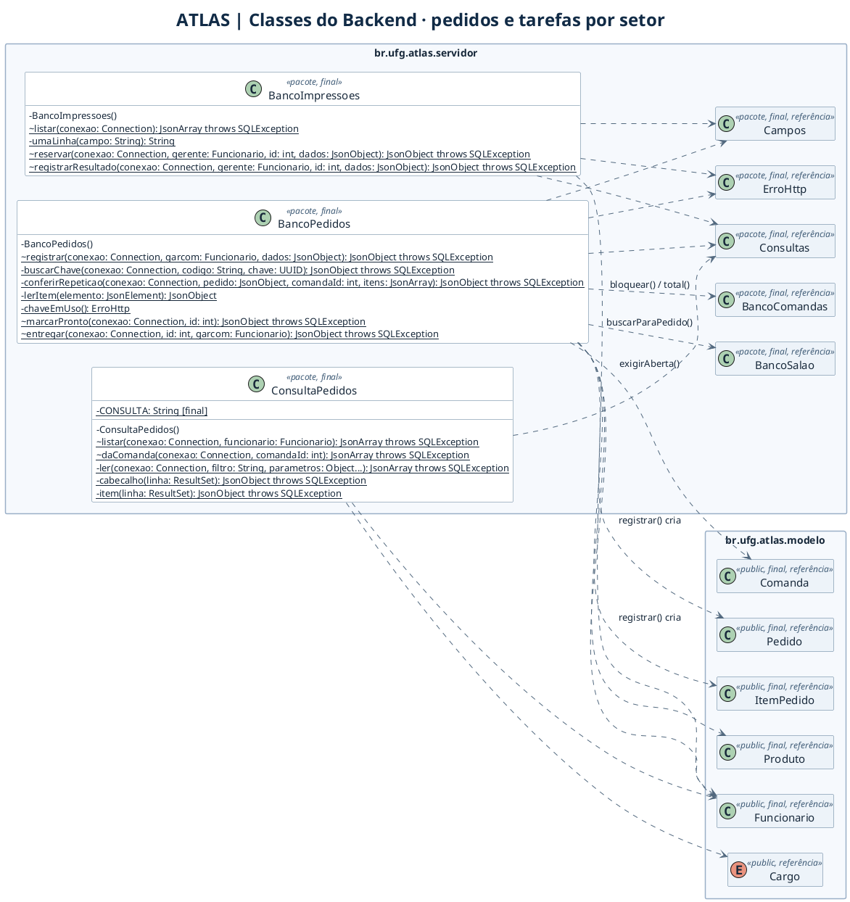
```plantuml
@startuml
title ATLAS | Classes do Backend · pedidos e tarefas por setor
skinparam backgroundColor #FFFFFF
skinparam defaultFontName Arial
skinparam defaultFontColor #17283A
skinparam titleFontColor #112B46
skinparam titleFontSize 24
skinparam shadowing false
skinparam ArrowColor #51687E
skinparam packageStyle rectangle
skinparam packageBackgroundColor #F6F9FD
skinparam packageBorderColor #9AAFC7
skinparam classBackgroundColor #FFFFFF
skinparam classBorderColor #547693
skinparam classAttributeFontSize 13
skinparam classFontSize 15
skinparam classAttributeIconSize 0
skinparam classStereotypeFontColor #405C77
skinparam noteBackgroundColor #FFF6DB
skinparam noteBorderColor #AF9055
skinparam nodesep 34
skinparam ranksep 48
set separator none
hide empty members
left to right direction

package "br.ufg.atlas.servidor" {
  ' Backend/src/main/java/br/ufg/atlas/servidor/BancoPedidos.java:16
  class "BancoPedidos" as J_servidor_BancoPedidos <<pacote, final>> {
    ' linha 17
    {method} -BancoPedidos()
    ' linha 19
    {method} {static} ~registrar(conexao: Connection, garcom: Funcionario, dados: JsonObject): JsonObject throws SQLException
    ' linha 64
    {method} {static} -buscarChave(conexao: Connection, codigo: String, chave: UUID): JsonObject throws SQLException
    ' linha 69
    {method} {static} -conferirRepeticao(conexao: Connection, pedido: JsonObject, comandaId: int, itens: JsonArray): JsonObject throws SQLException
    ' linha 89
    {method} {static} -lerItem(elemento: JsonElement): JsonObject
    ' linha 94
    {method} {static} -chaveEmUso(): ErroHttp
    ' linha 98
    {method} {static} ~marcarPronto(conexao: Connection, id: int): JsonObject throws SQLException
    ' linha 105
    {method} {static} ~entregar(conexao: Connection, id: int, garcom: Funcionario): JsonObject throws SQLException
  }

  ' Backend/src/main/java/br/ufg/atlas/servidor/ConsultaPedidos.java:13
  class "ConsultaPedidos" as J_servidor_ConsultaPedidos <<pacote, final>> {
    ' linha 14
    {field} {static} -CONSULTA: String [final]
    ' linha 19
    {method} -ConsultaPedidos()
    ' linha 21
    {method} {static} ~listar(conexao: Connection, funcionario: Funcionario): JsonArray throws SQLException
    ' linha 28
    {method} {static} ~daComanda(conexao: Connection, comandaId: int): JsonArray throws SQLException
    ' linha 32
    {method} {static} -ler(conexao: Connection, filtro: String, parametros: Object...): JsonArray throws SQLException
    ' linha 57
    {method} {static} -cabecalho(linha: ResultSet): JsonObject throws SQLException
    ' linha 70
    {method} {static} -item(linha: ResultSet): JsonObject throws SQLException
  }

  ' Backend/src/main/java/br/ufg/atlas/servidor/BancoImpressoes.java:11
  class "BancoImpressoes" as J_servidor_BancoImpressoes <<pacote, final>> {
    ' linha 12
    {method} -BancoImpressoes()
    ' linha 14
    {method} {static} ~listar(conexao: Connection): JsonArray throws SQLException
    ' linha 55
    {method} {static} -umaLinha(campo: String): String
    ' linha 59
    {method} {static} ~reservar(conexao: Connection, gerente: Funcionario, id: int, dados: JsonObject): JsonObject throws SQLException
    ' linha 71
    {method} {static} ~registrarResultado(conexao: Connection, gerente: Funcionario, id: int, dados: JsonObject): JsonObject throws SQLException
  }

  ' Backend/src/main/java/br/ufg/atlas/servidor/BancoComandas.java:13
  class "BancoComandas" as J_servidor_BancoComandas <<pacote, final, referência>> #EDF3F9

  ' Backend/src/main/java/br/ufg/atlas/servidor/BancoSalao.java:10
  class "BancoSalao" as J_servidor_BancoSalao <<pacote, final, referência>> #EDF3F9

  ' Backend/src/main/java/br/ufg/atlas/servidor/Consultas.java:15
  class "Consultas" as J_servidor_Consultas <<pacote, final, referência>> #EDF3F9

  ' Backend/src/main/java/br/ufg/atlas/servidor/Campos.java:7
  class "Campos" as J_servidor_Campos <<pacote, final, referência>> #EDF3F9

  ' Backend/src/main/java/br/ufg/atlas/servidor/ErroHttp.java:3
  class "ErroHttp" as J_servidor_ErroHttp <<pacote, final, referência>> #EDF3F9
}

package "br.ufg.atlas.modelo" {
  ' Modelo/src/main/java/br/ufg/atlas/modelo/Comanda.java:6
  class "Comanda" as J_modelo_Comanda <<public, final, referência>> #EDF3F9

  ' Modelo/src/main/java/br/ufg/atlas/modelo/Pedido.java:6
  class "Pedido" as J_modelo_Pedido <<public, final, referência>> #EDF3F9

  ' Modelo/src/main/java/br/ufg/atlas/modelo/ItemPedido.java:3
  class "ItemPedido" as J_modelo_ItemPedido <<public, final, referência>> #EDF3F9

  ' Modelo/src/main/java/br/ufg/atlas/modelo/Produto.java:3
  class "Produto" as J_modelo_Produto <<public, final, referência>> #EDF3F9

  ' Modelo/src/main/java/br/ufg/atlas/modelo/Funcionario.java:3
  class "Funcionario" as J_modelo_Funcionario <<public, final, referência>> #EDF3F9

  ' Modelo/src/main/java/br/ufg/atlas/modelo/Cargo.java:3
  enum "Cargo" as J_modelo_Cargo <<public, referência>> #EDF3F9
}

J_servidor_BancoPedidos ..> J_servidor_BancoComandas : bloquear() / total()
J_servidor_BancoPedidos ..> J_servidor_BancoSalao : buscarParaPedido()
J_servidor_BancoPedidos ..> J_modelo_Comanda : exigirAberta()
J_servidor_BancoPedidos ..> J_modelo_Pedido : registrar() cria
J_servidor_BancoPedidos ..> J_modelo_ItemPedido : registrar() cria
J_servidor_BancoPedidos ..> J_modelo_Produto
J_servidor_BancoPedidos ..> J_modelo_Funcionario
J_servidor_BancoPedidos ..> J_servidor_Consultas
J_servidor_BancoPedidos ..> J_servidor_Campos
J_servidor_BancoPedidos ..> J_servidor_ErroHttp
J_servidor_ConsultaPedidos ..> J_servidor_Consultas
J_servidor_ConsultaPedidos ..> J_modelo_Funcionario
J_servidor_ConsultaPedidos ..> J_modelo_Cargo
J_servidor_BancoImpressoes ..> J_servidor_Consultas
J_servidor_BancoImpressoes ..> J_servidor_Campos
J_servidor_BancoImpressoes ..> J_servidor_ErroHttp
J_servidor_BancoImpressoes ..> J_modelo_Funcionario
@enduml
```

## 09 · Classes do Desktop · aplicação, sessão e transporte

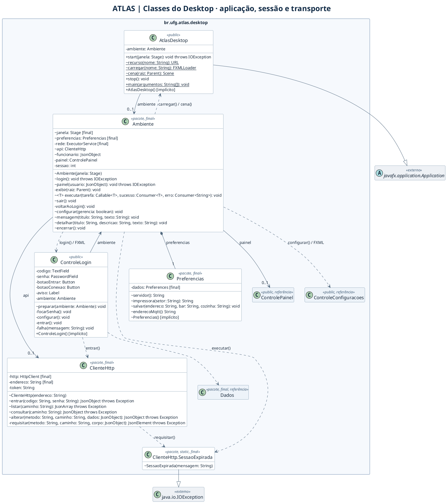
```plantuml
@startuml
title ATLAS | Classes do Desktop · aplicação, sessão e transporte
skinparam backgroundColor #FFFFFF
skinparam defaultFontName Arial
skinparam defaultFontColor #17283A
skinparam titleFontColor #112B46
skinparam titleFontSize 24
skinparam shadowing false
skinparam ArrowColor #51687E
skinparam packageStyle rectangle
skinparam packageBackgroundColor #F6F9FD
skinparam packageBorderColor #9AAFC7
skinparam classBackgroundColor #FFFFFF
skinparam classBorderColor #547693
skinparam classAttributeFontSize 13
skinparam classFontSize 15
skinparam classAttributeIconSize 0
skinparam classStereotypeFontColor #405C77
skinparam noteBackgroundColor #FFF6DB
skinparam noteBorderColor #AF9055
skinparam nodesep 34
skinparam ranksep 48
set separator none
hide empty members

package "br.ufg.atlas.desktop" {
  ' Desktop/src/main/java/br/ufg/atlas/desktop/AtlasDesktop.java:12
  class "AtlasDesktop" as J_desktop_AtlasDesktop <<public>> {
    ' linha 13
    {field} -ambiente: Ambiente
    ' linha 15
    {method} +start(janela: Stage): void throws IOException
    ' linha 27
    {method} {static} ~recurso(nome: String): URL
    ' linha 33
    {method} {static} ~carregar(nome: String): FXMLLoader
    ' linha 37
    {method} {static} ~cena(raiz: Parent): Scene
    ' linha 43
    {method} +stop(): void
    ' linha 48
    {method} {static} +main(argumentos: String[]): void
    ' linha 12
    {method} +AtlasDesktop() [implícito]
  }

  ' Desktop/src/main/java/br/ufg/atlas/desktop/Ambiente.java:18
  class "Ambiente" as J_desktop_Ambiente <<pacote, final>> {
    ' linha 19
    {field} ~janela: Stage [final]
    ' linha 20
    {field} ~preferencias: Preferencias [final]
    ' linha 21
    {field} -rede: ExecutorService [final]
    ' linha 26
    {field} ~api: ClienteHttp
    ' linha 27
    {field} ~funcionario: JsonObject
    ' linha 28
    {field} -painel: ControlePainel
    ' linha 29
    {field} -sessao: int
    ' linha 31
    {method} ~Ambiente(janela: Stage)
    ' linha 33
    {method} ~login(): void throws IOException
    ' linha 46
    {method} ~painel(usuario: JsonObject): void throws IOException
    ' linha 55
    {method} -exibir(raiz: Parent): void
    ' linha 60
    {method} <U+007E><T> executar(tarefa: Callable<T>, sucesso: Consumer<T>, erro: Consumer<String>): void
    ' linha 80
    {method} ~sair(): void
    ' linha 89
    {method} -voltarAoLogin(): void
    ' linha 94
    {method} ~configurar(gerencia: boolean): void
    ' linha 118
    {method} ~mensagem(titulo: String, texto: String): void
    ' linha 127
    {method} ~detalhar(titulo: String, descricao: String, texto: String): void
    ' linha 141
    {method} ~encerrar(): void
  }

  ' Desktop/src/main/java/br/ufg/atlas/desktop/ControleLogin.java:7
  class "ControleLogin" as J_desktop_ControleLogin <<public>> {
    ' linha 8
    {field} -codigo: TextField
    ' linha 9
    {field} -senha: PasswordField
    ' linha 10
    {field} -botaoEntrar: Button
    ' linha 10
    {field} -botaoConexao: Button
    ' linha 11
    {field} -aviso: Label
    ' linha 12
    {field} -ambiente: Ambiente
    ' linha 14
    {method} ~preparar(ambiente: Ambiente): void
    ' linha 16
    {method} -focarSenha(): void
    ' linha 17
    {method} -configurar(): void
    ' linha 19
    {method} -entrar(): void
    ' linha 46
    {method} -falha(mensagem: String): void
    ' linha 7
    {method} +ControleLogin() [implícito]
  }

  ' Desktop/src/main/java/br/ufg/atlas/desktop/ClienteHttp.java:15
  class "ClienteHttp" as J_desktop_ClienteHttp <<pacote, final>> {
    ' linha 16
    {field} -http: HttpClient [final]
    ' linha 17
    {field} -endereco: String [final]
    ' linha 18
    {field} -token: String
    ' linha 20
    {method} ~ClienteHttp(endereco: String)
    ' linha 24
    {method} ~entrar(codigo: String, senha: String): JsonObject throws Exception
    ' linha 33
    {method} ~listar(caminho: String): JsonArray throws Exception
    ' linha 37
    {method} ~consultar(caminho: String): JsonObject throws Exception
    ' linha 41
    {method} ~alterar(metodo: String, caminho: String, dados: JsonObject): JsonObject throws Exception
    ' linha 45
    {method} -requisitar(metodo: String, caminho: String, corpo: JsonObject): JsonElement throws Exception
  }

  ' Desktop/src/main/java/br/ufg/atlas/desktop/ClienteHttp.java:76
  class "ClienteHttp.SessaoExpirada" as J_desktop_ClienteHttp_SessaoExpirada <<pacote, static, final>> {
    ' linha 77
    {method} ~SessaoExpirada(mensagem: String)
  }

  ' Desktop/src/main/java/br/ufg/atlas/desktop/Preferencias.java:6
  class "Preferencias" as J_desktop_Preferencias <<pacote, final>> {
    ' linha 7
    {field} -dados: Preferences [final]
    ' linha 9
    {method} ~servidor(): String
    ' linha 13
    {method} ~impressora(setor: String): String
    ' linha 17
    {method} ~salvar(endereco: String, bar: String, cozinha: String): void
    ' linha 29
    {method} ~enderecoMqtt(): String
    ' linha 6
    {method} ~Preferencias() [implícito]
  }

  ' Desktop/src/main/java/br/ufg/atlas/desktop/ControlePainel.java:19
  class "ControlePainel" as J_desktop_ControlePainel <<public, referência>> #EDF3F9

  ' Desktop/src/main/java/br/ufg/atlas/desktop/ControleConfiguracoes.java:10
  class "ControleConfiguracoes" as J_desktop_ControleConfiguracoes <<public, referência>> #EDF3F9

  ' Desktop/src/main/java/br/ufg/atlas/desktop/Dados.java:12
  class "Dados" as J_desktop_Dados <<pacote, final, referência>> #EDF3F9
}

abstract class "javafx.application.Application" as Ext_Application <<externo>> #EEF1F5

class "java.io.IOException" as Ext_IOException <<externo>> #EEF1F5

J_desktop_AtlasDesktop --|> Ext_Application
J_desktop_ClienteHttp_SessaoExpirada --|> Ext_IOException
J_desktop_AtlasDesktop --> "0..1" J_desktop_Ambiente : ambiente
J_desktop_Ambiente ..> J_desktop_AtlasDesktop : carregar() / cena()
J_desktop_Ambiente *-- "1" J_desktop_Preferencias : preferencias
J_desktop_Ambiente --> "0..1" J_desktop_ClienteHttp : api
J_desktop_Ambiente --> "0..1" J_desktop_ControlePainel : painel
J_desktop_Ambiente ..> J_desktop_ControleLogin : login() / FXML
J_desktop_Ambiente ..> J_desktop_ControleConfiguracoes : configurar() / FXML
J_desktop_Ambiente ..> J_desktop_ClienteHttp_SessaoExpirada : executar()
J_desktop_ControleLogin --> J_desktop_Ambiente : ambiente
J_desktop_ControleLogin ..> J_desktop_ClienteHttp : entrar()
J_desktop_ControleLogin ..> J_desktop_Dados
J_desktop_ClienteHttp ..> J_desktop_ClienteHttp_SessaoExpirada : requisitar()
@enduml
```

## 10 · Classes do Desktop · painel, navegação e listagem

```plantuml
@startuml
title ATLAS | Classes do Desktop · painel, navegação e listagem
skinparam backgroundColor #FFFFFF
skinparam defaultFontName Arial
skinparam defaultFontColor #17283A
skinparam titleFontColor #112B46
skinparam titleFontSize 24
skinparam shadowing false
skinparam ArrowColor #51687E
skinparam packageStyle rectangle
skinparam packageBackgroundColor #F6F9FD
skinparam packageBorderColor #9AAFC7
skinparam classBackgroundColor #FFFFFF
skinparam classBorderColor #547693
skinparam classAttributeFontSize 13
skinparam classFontSize 15
skinparam classAttributeIconSize 0
skinparam classStereotypeFontColor #405C77
skinparam noteBackgroundColor #FFF6DB
skinparam noteBorderColor #AF9055
skinparam nodesep 34
skinparam ranksep 48
set separator none
hide empty members
left to right direction

package "br.ufg.atlas.desktop" {
  ' Desktop/src/main/java/br/ufg/atlas/desktop/ControlePainel.java:19
  class "ControlePainel" as J_desktop_ControlePainel <<public>> {
    ' linha 20
    {field} -titulo: Label
    ' linha 20
    {field} -operador: Label
    ' linha 20
    {field} -aviso: Label
    ' linha 21
    {field} -inicio: Button
    ' linha 21
    {field} -pedidos: Button
    ' linha 21
    {field} -salao: Button
    ' linha 21
    {field} -cardapio: Button
    ' linha 21
    {field} -funcionarios: Button
    ' linha 21
    {field} -financeiro: Button
    ' linha 21
    {field} -producao: Button
    ' linha 21
    {field} -historico: Button
    ' linha 21
    {field} -configuracoes: Button
    ' linha 22
    {field} -area: StackPane
    ' linha 23
    {field} -ambiente: Ambiente
    ' linha 24
    {field} -atual: Button
    ' linha 25
    {field} -resumo: ControleInicio
    ' linha 26
    {field} -listagem: Secoes
    ' linha 27
    {field} -notificacoes: AvisosMqtt
    ' linha 28
    {field} -consultaPeriodica: Timeline
    ' linha 29
    {field} -agruparEventos: PauseTransition [final]
    ' linha 30
    {field} -revisao: int
    ' linha 31
    {field} -consultando: boolean
    ' linha 31
    {field} -operando: boolean
    ' linha 31
    {field} -consultaPendente: boolean
    ' linha 31
    {field} -encerrado: boolean
    ' linha 33
    {method} ~preparar(ambiente: Ambiente): void throws IOException
    ' linha 53
    {method} -navegar(evento: ActionEvent): void
    ' linha 57
    {method} -navegarPara(destino: Button): void
    ' linha 62
    {method} -mostrar(botao: Button): void throws IOException
    ' linha 85
    {method} ~atualizar(): void
    ' linha 114
    {method} -terminarConsulta(mensagem: String): void
    ' linha 123
    {method} <U+007E><T> executar(tarefa: Callable<T>, sucesso: Consumer<T>): void
    ' linha 136
    {method} -concluirAcao(): void
    ' linha 142
    {method} ~ambiente(): Ambiente
    ' linha 144
    {method} ~trocarHistorico(): void
    ' linha 151
    {method} -configurar(): void
    ' linha 152
    {method} -sair(): void
    ' linha 154
    {method} ~encerrar(): void
    ' linha 19
    {method} +ControlePainel() [implícito]
  }

  ' Desktop/src/main/java/br/ufg/atlas/desktop/ControleInicio.java:9
  class "ControleInicio" as J_desktop_ControleInicio <<public>> {
    ' linha 10
    {field} -ocupadas: Label
    ' linha 10
    {field} -pendentes: Label
    ' linha 10
    {field} -contas: Label
    ' linha 11
    {field} -cartaoSalao: Button
    ' linha 11
    {field} -cartaoPedidos: Button
    ' linha 11
    {field} -cartaoFinanceiro: Button
    ' linha 13
    {method} ~preparar(abrirSalao: Runnable, abrirPedidos: Runnable, abrirFinanceiro: Runnable): void
    ' linha 19
    {method} ~consultar(api: ClienteHttp): int[] throws Exception
    ' linha 34
    {method} ~exibir(totais: int[]): void
    ' linha 9
    {method} +ControleInicio() [implícito]
  }

  ' Desktop/src/main/java/br/ufg/atlas/desktop/ControleListagem.java:15
  class "ControleListagem" as J_desktop_ControleListagem <<public>> {
    ' linha 16
    {field} -tabela: TableView<JsonObject>
    ' linha 17
    {field} -acaoPrincipal: Button
    ' linha 17
    {field} -acaoSecundaria: Button
    ' linha 17
    {field} -acaoTerciaria: Button
    ' linha 18
    {field} -botoes: Button[]
    ' linha 19
    {field} -permissoes: Map<Button, Predicate<JsonObject>> [final]
    ' linha 21
    {method} -initialize(): void
    ' linha 37
    {method} ~coluna(titulo: String, valor: Function<JsonObject, String>): void
    ' linha 43
    {method} ~campo(titulo: String, nome: String): void
    ' linha 47
    {method} ~codigo(titulo: String, nome: String): void
    ' linha 51
    {method} ~dinheiro(titulo: String, nome: String): void
    ' linha 55
    {method} ~acao(posicao: int, titulo: String, permite: Predicate<JsonObject>, executar: Consumer<JsonObject>): void
    ' linha 68
    {method} ~limpar(): void
    ' linha 77
    {method} ~textoConformeSelecao(posicao: int, texto: Function<JsonObject, String>): void
    ' linha 82
    {method} ~preencher(dados: JsonArray, incluir: Predicate<JsonObject>): void
    ' linha 15
    {method} +ControleListagem() [implícito]
  }

  ' Desktop/src/main/java/br/ufg/atlas/desktop/Secoes.java:8
  class "Secoes" as J_desktop_Secoes <<pacote, final>> {
    ' linha 9
    {field} -painel: ControlePainel [final]
    ' linha 10
    {field} -tela: ControleListagem [final]
    ' linha 11
    {field} -operacoes: Operacoes [final]
    ' linha 12
    {field} -gerente: boolean [final]
    ' linha 13
    {field} -secao: String [final]
    ' linha 14
    {field} -rota: String
    ' linha 15
    {field} -filtro: Predicate<JsonObject>
    ' linha 16
    {field} -pedidosHistoricos: boolean
    ' linha 18
    {method} ~Secoes(painel: ControlePainel, tela: ControleListagem, secao: String)
    ' linha 36
    {method} ~rota(): String
    ' linha 37
    {method} ~preencher(dados: JsonArray): void
    ' linha 39
    {method} ~alternarHistorico(): void
    ' linha 47
    {method} -pedidos(historico: boolean): void
    ' linha 61
    {method} -salao(): void
    ' linha 71
    {method} -cardapio(): void
    ' linha 82
    {method} -funcionarios(): void
    ' linha 92
    {method} -contas(historico: boolean): void
    ' linha 104
    {method} -producao(): void
    ' linha 118
    {method} {static} -estado(linha: JsonObject, esperado: String): boolean
  }

  ' Desktop/src/main/java/br/ufg/atlas/desktop/AvisosMqtt.java:9
  class "AvisosMqtt" as J_desktop_AvisosMqtt <<pacote, final>> {
    ' linha 10
    {field} -executor: ScheduledExecutorService [final]
    ' linha 15
    {field} -cliente: MqttClient
    ' linha 16
    {field} -inscrito: boolean
    ' linha 17
    {field} -configuracao: Preferencias [final]
    ' linha 18
    {field} -mudou: Runnable [final]
    ' linha 20
    {method} ~AvisosMqtt(configuracao: Preferencias, mudou: Runnable)
    ' linha 25
    {method} ~iniciar(): void
    ' linha 29
    {method} -acompanhar(): void
    ' linha 57
    {method} ~encerrar(): void
    ' linha 63
    {method} -fecharCliente(): void
  }

  ' Desktop/src/main/java/br/ufg/atlas/desktop/Ambiente.java:18
  class "Ambiente" as J_desktop_Ambiente <<pacote, final, referência>> #EDF3F9

  ' Desktop/src/main/java/br/ufg/atlas/desktop/AtlasDesktop.java:12
  class "AtlasDesktop" as J_desktop_AtlasDesktop <<public, referência>> #EDF3F9

  ' Desktop/src/main/java/br/ufg/atlas/desktop/Preferencias.java:6
  class "Preferencias" as J_desktop_Preferencias <<pacote, final, referência>> #EDF3F9

  ' Desktop/src/main/java/br/ufg/atlas/desktop/ClienteHttp.java:15
  class "ClienteHttp" as J_desktop_ClienteHttp <<pacote, final, referência>> #EDF3F9

  ' Desktop/src/main/java/br/ufg/atlas/desktop/Dados.java:12
  class "Dados" as J_desktop_Dados <<pacote, final, referência>> #EDF3F9

  ' Desktop/src/main/java/br/ufg/atlas/desktop/Operacoes.java:10
  class "Operacoes" as J_desktop_Operacoes <<pacote, final, referência>> #EDF3F9

  ' Desktop/src/main/java/br/ufg/atlas/desktop/FilaProducao.java:12
  class "FilaProducao" as J_desktop_FilaProducao <<pacote, final, referência>> #EDF3F9
}

J_desktop_ControlePainel --> J_desktop_Ambiente : ambiente
J_desktop_ControlePainel --> "0..1" J_desktop_ControleInicio : resumo
J_desktop_ControlePainel --> "0..1" J_desktop_Secoes : listagem
J_desktop_ControlePainel --> "0..1" J_desktop_AvisosMqtt : notificacoes
J_desktop_ControlePainel ..> J_desktop_AtlasDesktop : mostrar()
J_desktop_ControlePainel ..> J_desktop_ClienteHttp
J_desktop_ControlePainel ..> J_desktop_Dados
J_desktop_Secoes --> "1" J_desktop_ControlePainel : painel
J_desktop_Secoes --> "1" J_desktop_ControleListagem : tela
J_desktop_Secoes *-- "1" J_desktop_Operacoes : operacoes
J_desktop_Secoes ..> J_desktop_FilaProducao : producao() cria
J_desktop_Secoes ..> J_desktop_Dados
J_desktop_ControleInicio ..> J_desktop_ClienteHttp : consultar()
J_desktop_ControleInicio ..> J_desktop_Dados
J_desktop_ControleListagem ..> J_desktop_Dados
J_desktop_AvisosMqtt --> "1" J_desktop_Preferencias : configuracao

note right of J_desktop_ControlePainel
  A navegação limpa resumo e listagem.
  A área aberta atribui somente um deles.
end note
@enduml
```

## 11 · Classes do Desktop · cadastros, financeiro e impressão

```plantuml
@startuml
title ATLAS | Classes do Desktop · cadastros, financeiro e impressão
skinparam backgroundColor #FFFFFF
skinparam defaultFontName Arial
skinparam defaultFontColor #17283A
skinparam titleFontColor #112B46
skinparam titleFontSize 24
skinparam shadowing false
skinparam ArrowColor #51687E
skinparam packageStyle rectangle
skinparam packageBackgroundColor #F6F9FD
skinparam packageBorderColor #9AAFC7
skinparam classBackgroundColor #FFFFFF
skinparam classBorderColor #547693
skinparam classAttributeFontSize 13
skinparam classFontSize 15
skinparam classAttributeIconSize 0
skinparam classStereotypeFontColor #405C77
skinparam noteBackgroundColor #FFF6DB
skinparam noteBorderColor #AF9055
skinparam nodesep 34
skinparam ranksep 48
set separator none
hide empty members
left to right direction

package "br.ufg.atlas.desktop" {
  ' Desktop/src/main/java/br/ufg/atlas/desktop/Operacoes.java:10
  class "Operacoes" as J_desktop_Operacoes <<pacote, final>> {
    ' linha 11
    {field} -ambiente: Ambiente [final]
    ' linha 12
    {field} -painel: ControlePainel [final]
    ' linha 13
    {field} -janela: Window [final]
    ' linha 15
    {method} ~Operacoes(painel: ControlePainel)
    ' linha 21
    {method} ~editar(tipo: String, anterior: JsonObject): void
    ' linha 41
    {method} ~pagar(linha: JsonObject): void
    ' linha 51
    {method} ~pronto(linha: JsonObject): void
    ' linha 56
    {method} -salvar(metodo: String, rota: String, dados: JsonObject, mensagem: String): void
    ' linha 61
    {method} ~comanda(id: String): void
    ' linha 68
    {method} ~pedido(dados: JsonObject): void
    ' linha 77
    {method} ~comprovante(tarefa: JsonObject): void
  }

  ' Desktop/src/main/java/br/ufg/atlas/desktop/Formularios.java:14
  class "Formularios" as J_desktop_Formularios <<pacote, final>> {
    ' linha 15
    {field} -arquivo: FXMLLoader [final]
    ' linha 16
    {field} -dialogo: Dialog<JsonObject> [final]
    ' linha 17
    {field} -confirmar: ButtonType [final]
    ' linha 18
    {field} -resultado: JsonObject
    ' linha 20
    {method} -Formularios(janela: Window, tela: String, titulo: String) throws IOException
    ' linha 31
    {method} -campo(nome: String): TextField
    ' linha 32
    {method} -caixa(nome: String): CheckBox
    ' linha 34
    {method} -opcoes(nome: String, valores: String...): ComboBox<String>
    ' linha 46
    {method} -solicitar(ler: Supplier<JsonObject>): Optional<JsonObject>
    ' linha 58
    {method} -obrigatorio(nome: String): String
    ' linha 64
    {method} {static} ~mesa(janela: Window): Optional<JsonObject> throws IOException
    ' linha 77
    {method} {static} ~produto(janela: Window, anterior: JsonObject): Optional<JsonObject> throws IOException
    ' linha 104
    {method} {static} ~funcionario(janela: Window, anterior: JsonObject): Optional<JsonObject> throws IOException
    ' linha 129
    {method} {static} ~pagamento(janela: Window, conta: JsonObject): Optional<JsonObject> throws IOException
  }

  ' Desktop/src/main/java/br/ufg/atlas/desktop/Formularios.java:38
  class "Formularios.java:38" as J_desktop_Formularios_anon_38 <<anônima>> {
    ' linha 39
    {method} +toString(valor: String): String
    ' linha 40
    {method} +fromString(texto: String): String
  }

  ' Desktop/src/main/java/br/ufg/atlas/desktop/FilaProducao.java:12
  class "FilaProducao" as J_desktop_FilaProducao <<pacote, final>> {
    ' linha 13
    {field} -painel: ControlePainel [final]
    ' linha 14
    {field} -ambiente: Ambiente [final]
    ' linha 16
    {method} ~FilaProducao(painel: ControlePainel)
    ' linha 21
    {method} ~imprimir(tarefa: JsonObject): void
    ' linha 63
    {method} ~conferir(tarefa: JsonObject): void
    ' linha 89
    {method} {static} -resultado(api: ClienteHttp, rota: String, tentativa: int, estado: String, detalhe: String, conferido: boolean): JsonObject throws Exception
  }

  ' Desktop/src/main/java/br/ufg/atlas/desktop/Impressao.java:20
  class "Impressao" as J_desktop_Impressao <<pacote, final>> {
    ' linha 21
    {method} {static} ~filas(): List<String>
    ' linha 30
    {method} {static} ~localizar(nome: String): PrintService
    ' linha 37
    {method} {static} ~enviar(fila: PrintService, titulo: String, comprovante: String): void throws PrintException
    ' linha 45
    {method} {static} -desenhar(grafico: Graphics, papel: PageFormat, pagina: int, texto: String): int
    ' linha 20
    {method} ~Impressao() [implícito]
  }

  ' Desktop/src/main/java/br/ufg/atlas/desktop/ControleConfiguracoes.java:10
  class "ControleConfiguracoes" as J_desktop_ControleConfiguracoes <<public>> {
    ' linha 11
    {field} -servidor: TextField
    ' linha 12
    {field} -impressoras: VBox
    ' linha 13
    {field} -bar: ComboBox<String>
    ' linha 13
    {field} -cozinha: ComboBox<String>
    ' linha 14
    {field} -aviso: Label
    ' linha 15
    {field} -ambiente: Ambiente
    ' linha 16
    {field} -janela: Stage
    ' linha 18
    {method} ~preparar(ambiente: Ambiente, janela: Stage, gerencia: boolean): void
    ' linha 35
    {method} -salvar(): void
    ' linha 44
    {method} -cancelar(): void
    ' linha 10
    {method} +ControleConfiguracoes() [implícito]
  }

  ' Desktop/src/main/java/br/ufg/atlas/desktop/Dados.java:12
  class "Dados" as J_desktop_Dados <<pacote, final>> {
    ' linha 13
    {field} {static} -BRASIL: Locale [final]
    ' linha 15
    {method} {static} ~texto(dados: JsonObject, campo: String): String
    ' linha 20
    {method} {static} ~reais(centavos: long): String
    ' linha 24
    {method} {static} ~rotulo(codigo: String): String
    ' linha 40
    {method} {static} ~dataLocal(data: String): String
    ' linha 49
    {method} {static} ~itens(pedido: JsonObject): String
    ' linha 64
    {method} {static} ~consumo(comanda: JsonObject): String
    ' linha 12
    {method} ~Dados() [implícito]
  }

  ' Desktop/src/main/java/br/ufg/atlas/desktop/Ambiente.java:18
  class "Ambiente" as J_desktop_Ambiente <<pacote, final, referência>> #EDF3F9

  ' Desktop/src/main/java/br/ufg/atlas/desktop/ControlePainel.java:19
  class "ControlePainel" as J_desktop_ControlePainel <<public, referência>> #EDF3F9

  ' Desktop/src/main/java/br/ufg/atlas/desktop/ClienteHttp.java:15
  class "ClienteHttp" as J_desktop_ClienteHttp <<pacote, final, referência>> #EDF3F9

  ' Desktop/src/main/java/br/ufg/atlas/desktop/AtlasDesktop.java:12
  class "AtlasDesktop" as J_desktop_AtlasDesktop <<public, referência>> #EDF3F9

  ' Desktop/src/main/java/br/ufg/atlas/desktop/Preferencias.java:6
  class "Preferencias" as J_desktop_Preferencias <<pacote, final, referência>> #EDF3F9
}

abstract class "javafx.util.StringConverter<String>" as Ext_javafx_util_StringConverter_String_ <<externo>> #EEF1F5

J_desktop_Formularios_anon_38 --|> Ext_javafx_util_StringConverter_String_
J_desktop_Operacoes --> "1" J_desktop_ControlePainel : painel
J_desktop_Operacoes --> "1" J_desktop_Ambiente : ambiente
J_desktop_Operacoes ..> J_desktop_Formularios : editar() / pagar()
J_desktop_Operacoes ..> J_desktop_ClienteHttp
J_desktop_Operacoes ..> J_desktop_Dados
J_desktop_Formularios ..> J_desktop_AtlasDesktop : carregar() / recurso()
J_desktop_Formularios ..> J_desktop_Dados
J_desktop_Formularios ..> J_desktop_Formularios_anon_38 : opcoes() cria
J_desktop_FilaProducao --> "1" J_desktop_ControlePainel : painel
J_desktop_FilaProducao --> "1" J_desktop_Ambiente : ambiente
J_desktop_FilaProducao ..> J_desktop_Preferencias : impressora()
J_desktop_FilaProducao ..> J_desktop_ClienteHttp
J_desktop_FilaProducao ..> J_desktop_Impressao : localizar() / enviar()
J_desktop_FilaProducao ..> J_desktop_Dados
J_desktop_ControleConfiguracoes --> J_desktop_Ambiente : ambiente
J_desktop_ControleConfiguracoes ..> J_desktop_Preferencias
J_desktop_ControleConfiguracoes ..> J_desktop_Impressao : filas()
@enduml
```

## 12 · Classes do Android · login, atendimento e callbacks

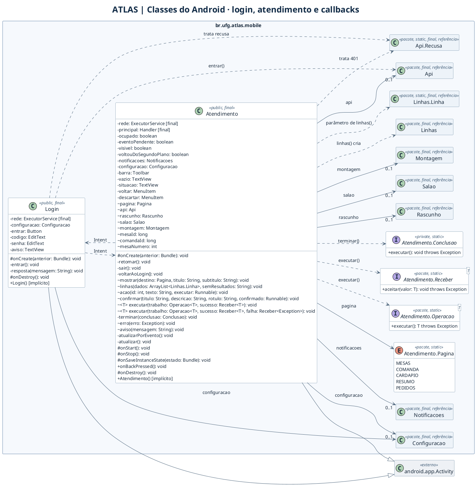
```plantuml
@startuml
title ATLAS | Classes do Android · login, atendimento e callbacks
skinparam backgroundColor #FFFFFF
skinparam defaultFontName Arial
skinparam defaultFontColor #17283A
skinparam titleFontColor #112B46
skinparam titleFontSize 24
skinparam shadowing false
skinparam ArrowColor #51687E
skinparam packageStyle rectangle
skinparam packageBackgroundColor #F6F9FD
skinparam packageBorderColor #9AAFC7
skinparam classBackgroundColor #FFFFFF
skinparam classBorderColor #547693
skinparam classAttributeFontSize 13
skinparam classFontSize 15
skinparam classAttributeIconSize 0
skinparam classStereotypeFontColor #405C77
skinparam noteBackgroundColor #FFF6DB
skinparam noteBorderColor #AF9055
skinparam nodesep 34
skinparam ranksep 48
set separator none
hide empty members
left to right direction

package "br.ufg.atlas.mobile" {
  ' Mobile/app/src/main/java/br/ufg/atlas/mobile/Login.java:15
  class "Login" as J_mobile_Login <<public, final>> {
    ' linha 16
    {field} -rede: ExecutorService [final]
    ' linha 17
    {field} -configuracao: Configuracao
    ' linha 18
    {field} -entrar: Button
    ' linha 19
    {field} -codigo: EditText
    ' linha 20
    {field} -senha: EditText
    ' linha 21
    {field} -aviso: TextView
    ' linha 23
    {method} #onCreate(anterior: Bundle): void
    ' linha 47
    {method} -entrar(): void
    ' linha 89
    {method} -resposta(mensagem: String): void
    ' linha 97
    {method} #onDestroy(): void
    ' linha 15
    {method} +Login() [implícito]
  }

  ' Mobile/app/src/main/java/br/ufg/atlas/mobile/Atendimento.java:21
  class "Atendimento" as J_mobile_Atendimento <<public, final>> {
    ' linha 26
    {field} -rede: ExecutorService [final]
    ' linha 27
    {field} -principal: Handler [final]
    ' linha 28
    {field} -ocupado: boolean
    ' linha 29
    {field} -eventoPendente: boolean
    ' linha 30
    {field} -visivel: boolean
    ' linha 31
    {field} -voltouDoSegundoPlano: boolean
    ' linha 32
    {field} -notificacoes: Notificacoes
    ' linha 33
    {field} -configuracao: Configuracao
    ' linha 34
    {field} -barra: Toolbar
    ' linha 35
    {field} -vazio: TextView
    ' linha 36
    {field} -situacao: TextView
    ' linha 37
    {field} -voltar: MenuItem
    ' linha 38
    {field} -descartar: MenuItem
    ' linha 39
    {field} ~pagina: Pagina
    ' linha 40
    {field} ~api: Api
    ' linha 41
    {field} ~rascunho: Rascunho
    ' linha 42
    {field} ~salao: Salao
    ' linha 43
    {field} ~montagem: Montagem
    ' linha 44
    {field} ~mesaId: long
    ' linha 45
    {field} ~comandaId: long
    ' linha 46
    {field} ~mesaNumero: int
    ' linha 48
    {method} #onCreate(anterior: Bundle): void
    ' linha 101
    {method} -retomar(): void
    ' linha 111
    {method} -sair(): void
    ' linha 117
    {method} -voltarAoLogin(): void
    ' linha 122
    {method} ~mostrar(destino: Pagina, titulo: String, subtitulo: String): void
    ' linha 136
    {method} ~linhas(dados: ArrayList<Linhas.Linha>, semResultados: String): void
    ' linha 151
    {method} ~acao(id: int, texto: String, executar: Runnable): void
    ' linha 158
    {method} ~confirmar(titulo: String, descricao: String, rotulo: String, confirmado: Runnable): void
    ' linha 165
    {method} <U+007E><T> executar(trabalho: Operacao<T>, sucesso: Receber<T>): void
    ' linha 169
    {method} <U+007E><T> executar(trabalho: Operacao<T>, sucesso: Receber<T>, falha: Receber<Exception>): void
    ' linha 189
    {method} -terminar(conclusao: Conclusao): void
    ' linha 200
    {method} ~erro(erro: Exception): void
    ' linha 207
    {method} ~aviso(mensagem: String): void
    ' linha 209
    {method} -atualizarPorEvento(): void
    ' linha 216
    {method} -atualizar(): void
    ' linha 226
    {method} #onStart(): void
    ' linha 246
    {method} #onStop(): void
    ' linha 253
    {method} #onSaveInstanceState(estado: Bundle): void
    ' linha 261
    {method} +onBackPressed(): void
    ' linha 272
    {method} #onDestroy(): void
    ' linha 21
    {method} +Atendimento() [implícito]
  }

  ' Mobile/app/src/main/java/br/ufg/atlas/mobile/Atendimento.java:22
  enum "Atendimento.Pagina" as J_mobile_Atendimento_Pagina <<pacote, static>> {
    ' linha 22
    MESAS
    ' linha 22
    COMANDA
    ' linha 22
    CARDAPIO
    ' linha 22
    RESUMO
    ' linha 22
    PEDIDOS
  }

  ' Mobile/app/src/main/java/br/ufg/atlas/mobile/Atendimento.java:23
  interface "Atendimento.Operacao<T>" as J_mobile_Atendimento_Operacao <<pacote, static>> {
    ' linha 23
    {method} +executar(): T throws Exception
  }

  ' Mobile/app/src/main/java/br/ufg/atlas/mobile/Atendimento.java:24
  interface "Atendimento.Receber<T>" as J_mobile_Atendimento_Receber <<pacote, static>> {
    ' linha 24
    {method} +aceitar(valor: T): void throws Exception
  }

  ' Mobile/app/src/main/java/br/ufg/atlas/mobile/Atendimento.java:188
  interface "Atendimento.Conclusao" as J_mobile_Atendimento_Conclusao <<private, static>> {
    ' linha 188
    {method} +executar(): void throws Exception
  }

  ' Mobile/app/src/main/java/br/ufg/atlas/mobile/Configuracao.java:11
  class "Configuracao" as J_mobile_Configuracao <<pacote, final, referência>> #EDF3F9

  ' Mobile/app/src/main/java/br/ufg/atlas/mobile/Api.java:15
  class "Api" as J_mobile_Api <<pacote, final, referência>> #EDF3F9

  ' Mobile/app/src/main/java/br/ufg/atlas/mobile/Api.java:16
  class "Api.Recusa" as J_mobile_Api_Recusa <<pacote, static, final, referência>> #EDF3F9

  ' Mobile/app/src/main/java/br/ufg/atlas/mobile/Rascunho.java:10
  class "Rascunho" as J_mobile_Rascunho <<pacote, final, referência>> #EDF3F9

  ' Mobile/app/src/main/java/br/ufg/atlas/mobile/Salao.java:8
  class "Salao" as J_mobile_Salao <<pacote, final, referência>> #EDF3F9

  ' Mobile/app/src/main/java/br/ufg/atlas/mobile/Montagem.java:17
  class "Montagem" as J_mobile_Montagem <<pacote, final, referência>> #EDF3F9

  ' Mobile/app/src/main/java/br/ufg/atlas/mobile/Linhas.java:11
  class "Linhas" as J_mobile_Linhas <<pacote, final, referência>> #EDF3F9

  ' Mobile/app/src/main/java/br/ufg/atlas/mobile/Linhas.java:12
  class "Linhas.Linha" as J_mobile_Linhas_Linha <<pacote, static, final, referência>> #EDF3F9

  ' Mobile/app/src/main/java/br/ufg/atlas/mobile/Notificacoes.java:14
  class "Notificacoes" as J_mobile_Notificacoes <<pacote, final, referência>> #EDF3F9
}

class "android.app.Activity" as Ext_Activity <<externo>> #EEF1F5

J_mobile_Login --|> Ext_Activity
J_mobile_Atendimento --|> Ext_Activity
J_mobile_Login --> J_mobile_Configuracao : configuracao
J_mobile_Login ..> J_mobile_Api : entrar()
J_mobile_Login ..> J_mobile_Api_Recusa : trata recusa
J_mobile_Login ..> J_mobile_Atendimento : Intent
J_mobile_Atendimento ..> J_mobile_Login : Intent
J_mobile_Atendimento --> J_mobile_Atendimento_Pagina : pagina
J_mobile_Atendimento ..> J_mobile_Atendimento_Operacao : executar()
J_mobile_Atendimento ..> J_mobile_Atendimento_Receber : executar()
J_mobile_Atendimento ..> J_mobile_Atendimento_Conclusao : terminar()
J_mobile_Atendimento --> "0..1" J_mobile_Notificacoes : notificacoes
J_mobile_Atendimento --> "0..1" J_mobile_Configuracao : configuracao
J_mobile_Atendimento --> "0..1" J_mobile_Api : api
J_mobile_Atendimento --> "0..1" J_mobile_Rascunho : rascunho
J_mobile_Atendimento --> "0..1" J_mobile_Salao : salao
J_mobile_Atendimento --> "0..1" J_mobile_Montagem : montagem
J_mobile_Atendimento ..> J_mobile_Api_Recusa : trata 401
J_mobile_Atendimento ..> J_mobile_Linhas : linhas() cria
J_mobile_Atendimento ..> J_mobile_Linhas_Linha : parâmetro de linhas()
@enduml
```

## 13 · Classes do Android · salão, montagem e rascunho

```plantuml
@startuml
title ATLAS | Classes do Android · salão, montagem e rascunho
skinparam backgroundColor #FFFFFF
skinparam defaultFontName Arial
skinparam defaultFontColor #17283A
skinparam titleFontColor #112B46
skinparam titleFontSize 24
skinparam shadowing false
skinparam ArrowColor #51687E
skinparam packageStyle rectangle
skinparam packageBackgroundColor #F6F9FD
skinparam packageBorderColor #9AAFC7
skinparam classBackgroundColor #FFFFFF
skinparam classBorderColor #547693
skinparam classAttributeFontSize 13
skinparam classFontSize 15
skinparam classAttributeIconSize 0
skinparam classStereotypeFontColor #405C77
skinparam noteBackgroundColor #FFF6DB
skinparam noteBorderColor #AF9055
skinparam nodesep 34
skinparam ranksep 48
set separator none
hide empty members
left to right direction

package "br.ufg.atlas.mobile" {
  ' Mobile/app/src/main/java/br/ufg/atlas/mobile/Salao.java:8
  class "Salao" as J_mobile_Salao <<pacote, final>> {
    ' linha 9
    {field} -tela: Atendimento [final]
    ' linha 11
    {method} ~Salao(tela: Atendimento)
    ' linha 13
    {method} ~mesas(): void
    ' linha 26
    {method} ~mesaLivre(): void
    ' linha 37
    {method} -selecionar(mesa: JSONObject): void
    ' linha 53
    {method} ~comanda(): void
    ' linha 84
    {method} -abrirCardapio(id: long): void
    ' linha 98
    {method} ~pedidos(): void
    ' linha 112
    {method} -detalhes(pedido: JSONObject, proprio: boolean): void
    ' linha 127
    {method} -descreverItens(pedido: JSONObject): String
  }

  ' Mobile/app/src/main/java/br/ufg/atlas/mobile/Montagem.java:17
  class "Montagem" as J_mobile_Montagem <<pacote, final>> {
    ' linha 18
    {field} -tela: Atendimento [final]
    ' linha 19
    {field} -pesquisa: EditText [final]
    ' linha 20
    {field} -categorias: Spinner [final]
    ' linha 21
    {field} -produtos: JSONArray
    ' linha 22
    {field} -nomesCategorias: ArrayList<String>
    ' linha 24
    {method} ~Montagem(tela: Atendimento)
    ' linha 39
    {method} ~cardapio(): void
    ' linha 46
    {method} ~atualizarProdutos(): void
    ' linha 65
    {method} -filtrar(): void
    ' linha 88
    {method} -editar(produto: long, nome: String, preco: long): void
    ' linha 121
    {method} -salvar(id: long, nome: String, preco: long, quantidade: int, observacao: String): boolean
    ' linha 132
    {method} ~resumo(): void
    ' linha 161
    {method} -subtituloDoEnvio(): String
    ' linha 165
    {method} -enviar(): void
  }

  ' Mobile/app/src/main/java/br/ufg/atlas/mobile/Rascunho.java:10
  class "Rascunho" as J_mobile_Rascunho <<pacote, final>> {
    ' linha 11
    {field} -arquivo: SharedPreferences [final]
    ' linha 12
    {field} -dono: String [final]
    ' linha 13
    {field} -comanda: long
    ' linha 14
    {field} -mesa: int
    ' linha 15
    {field} -chave: String
    ' linha 16
    {field} -itens: JSONArray
    ' linha 18
    {method} ~Rascunho(contexto: Context, servidor: String, codigo: String)
    ' linha 34
    {method} ~comanda(): long
    ' linha 35
    {method} ~mesa(): int
    ' linha 36
    {method} ~pendente(): boolean
    ' linha 37
    {method} ~itens(): JSONArray
    ' linha 39
    {method} ~iniciar(id: long, numero: int): void
    ' linha 46
    {method} ~indice(produto: long): int
    ' linha 53
    {method} ~editar(produto: long, nome: String, preco: long, quantidade: int, observacao: String): void
    ' linha 72
    {method} ~total(): long
    ' linha 81
    {method} ~prepararEnvio(): JSONObject
    ' linha 95
    {method} ~recusar(): void
    ' linha 100
    {method} ~limpar(): void
    ' linha 108
    {method} -salvar(): void
  }

  ' Mobile/app/src/main/java/br/ufg/atlas/mobile/Linhas.java:11
  class "Linhas" as J_mobile_Linhas <<pacote, final>> {
    ' linha 23
    {field} -linhas: ArrayList<Linha> [final]
    ' linha 24
    {field} -inflador: LayoutInflater [final]
    ' linha 25
    {field} -mesas: boolean [final]
    ' linha 27
    {method} ~Linhas(contexto: Context, linhas: ArrayList<Linha>, mesas: boolean)
    ' linha 33
    {method} +getCount(): int
    ' linha 34
    {method} +getItem(posicao: int): Linha
    ' linha 35
    {method} +getItemId(posicao: int): long
    ' linha 37
    {method} +getView(posicao: int, anterior: View, pai: ViewGroup): View
  }

  ' Mobile/app/src/main/java/br/ufg/atlas/mobile/Linhas.java:12
  class "Linhas.Linha" as J_mobile_Linhas_Linha <<pacote, static, final>> {
    ' linha 13
    {field} ~titulo: String [final]
    ' linha 14
    {field} ~detalhe: String [final]
    ' linha 15
    {field} ~selecionar: Runnable [final]
    ' linha 16
    {method} ~Linha(titulo: String, detalhe: String, selecionar: Runnable)
  }

  ' Mobile/app/src/main/java/br/ufg/atlas/mobile/Dados.java:10
  class "Dados" as J_mobile_Dados <<pacote, final>> {
    ' linha 11
    {method} -Dados()
    ' linha 13
    {method} {static} ~objeto(pares: Object...): JSONObject
    ' linha 25
    {method} {static} ~reais(centavos: long): String
    ' linha 29
    {method} {static} ~estado(valor: String): String
  }

  ' Mobile/app/src/main/java/br/ufg/atlas/mobile/Montagem.java:28
  class "Montagem.java:28" as J_mobile_Montagem_anon_28 <<anônima>> {
    ' linha 29
    {method} +beforeTextChanged(texto: CharSequence, inicio: int, tamanho: int, depois: int): void
    ' linha 30
    {method} +onTextChanged(texto: CharSequence, inicio: int, antes: int, tamanho: int): void
    ' linha 31
    {method} +afterTextChanged(texto: Editable): void
  }

  ' Mobile/app/src/main/java/br/ufg/atlas/mobile/Montagem.java:33
  class "Montagem.java:33" as J_mobile_Montagem_anon_33 <<anônima>> {
    ' linha 34
    {method} +onItemSelected(pai: AdapterView<?>, v: View, indice: int, id: long): void
    ' linha 35
    {method} +onNothingSelected(pai: AdapterView<?>): void
  }

  ' Mobile/app/src/main/java/br/ufg/atlas/mobile/Atendimento.java:21
  class "Atendimento" as J_mobile_Atendimento <<public, final, referência>> #EDF3F9

  ' Mobile/app/src/main/java/br/ufg/atlas/mobile/Atendimento.java:22
  enum "Atendimento.Pagina" as J_mobile_Atendimento_Pagina <<pacote, static, referência>> #EDF3F9

  ' Mobile/app/src/main/java/br/ufg/atlas/mobile/Api.java:15
  class "Api" as J_mobile_Api <<pacote, final, referência>> #EDF3F9

  ' Mobile/app/src/main/java/br/ufg/atlas/mobile/Api.java:16
  class "Api.Recusa" as J_mobile_Api_Recusa <<pacote, static, final, referência>> #EDF3F9
}

abstract class "android.widget.BaseAdapter" as Ext_BaseAdapter <<externo>> #EEF1F5

interface "android.text.TextWatcher" as Ext_TextWatcher <<externo>> #EEF1F5

interface "android.widget.AdapterView.OnItemSelectedListener" as Ext_AdapterView_OnItemSelectedListener <<externo>> #EEF1F5

J_mobile_Linhas --|> Ext_BaseAdapter
J_mobile_Montagem_anon_28 ..|> Ext_TextWatcher
J_mobile_Montagem_anon_33 ..|> Ext_AdapterView_OnItemSelectedListener
J_mobile_Salao --> "1" J_mobile_Atendimento : tela
J_mobile_Montagem --> "1" J_mobile_Atendimento : tela
J_mobile_Salao ..> J_mobile_Atendimento_Pagina
J_mobile_Montagem ..> J_mobile_Atendimento_Pagina
J_mobile_Salao ..> J_mobile_Dados
J_mobile_Salao ..> J_mobile_Api : tela.api
J_mobile_Salao ..> J_mobile_Api_Recusa : comanda() trata 404
J_mobile_Salao ..> J_mobile_Linhas_Linha : cria linhas
J_mobile_Salao ..> J_mobile_Rascunho : abrirCardapio()
J_mobile_Salao ..> J_mobile_Montagem : abrirCardapio()
J_mobile_Montagem ..> J_mobile_Dados
J_mobile_Montagem ..> J_mobile_Api : tela.api
J_mobile_Montagem ..> J_mobile_Api_Recusa : enviar()
J_mobile_Montagem ..> J_mobile_Rascunho : tela.rascunho
J_mobile_Montagem ..> J_mobile_Salao : enviar() → pedidos()
J_mobile_Montagem ..> J_mobile_Linhas_Linha : cria linhas
J_mobile_Montagem ..> J_mobile_Montagem_anon_28 : cria TextWatcher
J_mobile_Montagem ..> J_mobile_Montagem_anon_33 : cria listener
J_mobile_Linhas --> "0..*" J_mobile_Linhas_Linha : linhas
J_mobile_Rascunho ..> J_mobile_Dados : objeto()
@enduml
```

## 14 · Classes do Android · HTTP, configuração e MQTT

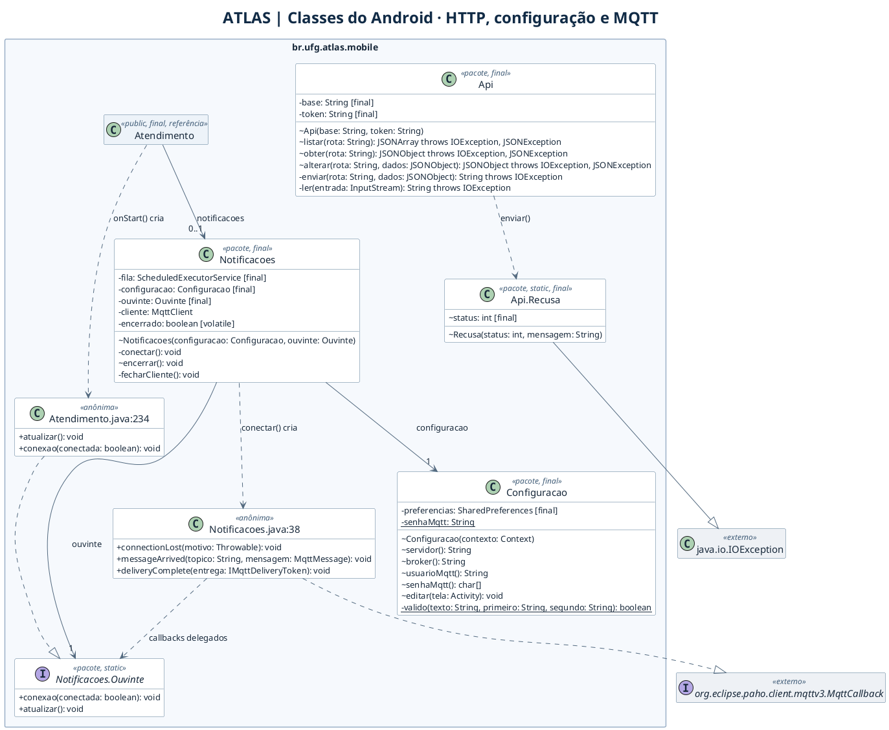
```plantuml
@startuml
title ATLAS | Classes do Android · HTTP, configuração e MQTT
skinparam backgroundColor #FFFFFF
skinparam defaultFontName Arial
skinparam defaultFontColor #17283A
skinparam titleFontColor #112B46
skinparam titleFontSize 24
skinparam shadowing false
skinparam ArrowColor #51687E
skinparam packageStyle rectangle
skinparam packageBackgroundColor #F6F9FD
skinparam packageBorderColor #9AAFC7
skinparam classBackgroundColor #FFFFFF
skinparam classBorderColor #547693
skinparam classAttributeFontSize 13
skinparam classFontSize 15
skinparam classAttributeIconSize 0
skinparam classStereotypeFontColor #405C77
skinparam noteBackgroundColor #FFF6DB
skinparam noteBorderColor #AF9055
skinparam nodesep 34
skinparam ranksep 48
set separator none
hide empty members

package "br.ufg.atlas.mobile" {
  ' Mobile/app/src/main/java/br/ufg/atlas/mobile/Api.java:15
  class "Api" as J_mobile_Api <<pacote, final>> {
    ' linha 24
    {field} -base: String [final]
    ' linha 25
    {field} -token: String [final]
    ' linha 27
    {method} ~Api(base: String, token: String)
    ' linha 32
    {method} ~listar(rota: String): JSONArray throws IOException, JSONException
    ' linha 36
    {method} ~obter(rota: String): JSONObject throws IOException, JSONException
    ' linha 40
    {method} ~alterar(rota: String, dados: JSONObject): JSONObject throws IOException, JSONException
    ' linha 44
    {method} -enviar(rota: String, dados: JSONObject): String throws IOException
    ' linha 79
    {method} -ler(entrada: InputStream): String throws IOException
  }

  ' Mobile/app/src/main/java/br/ufg/atlas/mobile/Api.java:16
  class "Api.Recusa" as J_mobile_Api_Recusa <<pacote, static, final>> {
    ' linha 17
    {field} ~status: int [final]
    ' linha 18
    {method} ~Recusa(status: int, mensagem: String)
  }

  ' Mobile/app/src/main/java/br/ufg/atlas/mobile/Configuracao.java:11
  class "Configuracao" as J_mobile_Configuracao <<pacote, final>> {
    ' linha 12
    {field} -preferencias: SharedPreferences [final]
    ' linha 13
    {field} {static} -senhaMqtt: String
    ' linha 15
    {method} ~Configuracao(contexto: Context)
    ' linha 19
    {method} ~servidor(): String
    ' linha 21
    {method} ~broker(): String
    ' linha 27
    {method} ~usuarioMqtt(): String
    ' linha 28
    {method} ~senhaMqtt(): char[]
    ' linha 30
    {method} ~editar(tela: Activity): void
    ' linha 63
    {method} {static} -valido(texto: String, primeiro: String, segundo: String): boolean
  }

  ' Mobile/app/src/main/java/br/ufg/atlas/mobile/Notificacoes.java:14
  class "Notificacoes" as J_mobile_Notificacoes <<pacote, final>> {
    ' linha 20
    {field} -fila: ScheduledExecutorService [final]
    ' linha 21
    {field} -configuracao: Configuracao [final]
    ' linha 22
    {field} -ouvinte: Ouvinte [final]
    ' linha 23
    {field} -cliente: MqttClient
    ' linha 24
    {field} -encerrado: boolean [volatile]
    ' linha 26
    {method} ~Notificacoes(configuracao: Configuracao, ouvinte: Ouvinte)
    ' linha 32
    {method} -conectar(): void
    ' linha 67
    {method} ~encerrar(): void
    ' linha 73
    {method} -fecharCliente(): void
  }

  ' Mobile/app/src/main/java/br/ufg/atlas/mobile/Notificacoes.java:15
  interface "Notificacoes.Ouvinte" as J_mobile_Notificacoes_Ouvinte <<pacote, static>> {
    ' linha 16
    {method} +conexao(conectada: boolean): void
    ' linha 17
    {method} +atualizar(): void
  }

  ' Mobile/app/src/main/java/br/ufg/atlas/mobile/Notificacoes.java:38
  class "Notificacoes.java:38" as J_mobile_Notificacoes_anon_38 <<anônima>> {
    ' linha 39
    {method} +connectionLost(motivo: Throwable): void
    ' linha 42
    {method} +messageArrived(topico: String, mensagem: MqttMessage): void
    ' linha 45
    {method} +deliveryComplete(entrega: IMqttDeliveryToken): void
  }

  ' Mobile/app/src/main/java/br/ufg/atlas/mobile/Atendimento.java:234
  class "Atendimento.java:234" as J_mobile_Atendimento_anon_234 <<anônima>> {
    ' linha 235
    {method} +atualizar(): void
    ' linha 236
    {method} +conexao(conectada: boolean): void
  }

  ' Mobile/app/src/main/java/br/ufg/atlas/mobile/Atendimento.java:21
  class "Atendimento" as J_mobile_Atendimento <<public, final, referência>> #EDF3F9
}

class "java.io.IOException" as Ext_IOException <<externo>> #EEF1F5

interface "org.eclipse.paho.client.mqttv3.MqttCallback" as Ext_MqttCallback <<externo>> #EEF1F5

J_mobile_Api_Recusa --|> Ext_IOException
J_mobile_Notificacoes_anon_38 ..|> Ext_MqttCallback
J_mobile_Atendimento_anon_234 ..|> J_mobile_Notificacoes_Ouvinte
J_mobile_Api ..> J_mobile_Api_Recusa : enviar()
J_mobile_Notificacoes --> "1" J_mobile_Configuracao : configuracao
J_mobile_Notificacoes --> "1" J_mobile_Notificacoes_Ouvinte : ouvinte
J_mobile_Notificacoes ..> J_mobile_Notificacoes_anon_38 : conectar() cria
J_mobile_Notificacoes_anon_38 ..> J_mobile_Notificacoes_Ouvinte : callbacks delegados
J_mobile_Atendimento ..> J_mobile_Atendimento_anon_234 : onStart() cria
J_mobile_Atendimento --> "0..1" J_mobile_Notificacoes : notificacoes
@enduml
```

## 15 · Classes de verificação existentes

```plantuml
@startuml
title ATLAS | Classes de verificação existentes
skinparam backgroundColor #FFFFFF
skinparam defaultFontName Arial
skinparam defaultFontColor #17283A
skinparam titleFontColor #112B46
skinparam titleFontSize 24
skinparam shadowing false
skinparam ArrowColor #51687E
skinparam packageStyle rectangle
skinparam packageBackgroundColor #F6F9FD
skinparam packageBorderColor #9AAFC7
skinparam classBackgroundColor #FFFFFF
skinparam classBorderColor #547693
skinparam classAttributeFontSize 13
skinparam classFontSize 15
skinparam classAttributeIconSize 0
skinparam classStereotypeFontColor #405C77
skinparam noteBackgroundColor #FFF6DB
skinparam noteBorderColor #AF9055
skinparam nodesep 34
skinparam ranksep 48
set separator none
hide empty members
left to right direction

package "br.ufg.atlas.servidor" {
  ' Backend/src/test/java/br/ufg/atlas/servidor/BancoDeTeste.java:12
  class "BancoDeTeste" as J_servidor_BancoDeTeste <<pacote, final>> {
    ' linha 13
    {field} -esquema: String [final]
    ' linha 14
    {field} -administracao: ConexaoBanco [final]
    ' linha 15
    {field} -isolado: ConexaoBanco [final]
    ' linha 16
    {field} -criado: boolean
    ' linha 18
    {method} ~BancoDeTeste(endereco: String, usuario: String, senha: String)
    ' linha 24
    {method} ~preparar(arquivo: Path, senhaGerente: String): ConexaoBanco throws Exception
    ' linha 47
    {method} +close(): void throws SQLException
  }

  ' Backend/src/test/java/br/ufg/atlas/servidor/TesteFluxoHttp.java:22
  class "TesteFluxoHttp" as J_servidor_TesteFluxoHttp <<public, final>> {
    ' linha 23
    {field} -cliente: HttpClient [final]
    ' linha 24
    {field} -base: String [final]
    ' linha 25
    {field} -senha: String [final]
    ' linha 27
    {method} -TesteFluxoHttp(porta: int, senha: String)
    ' linha 32
    {method} {static} +main(argumentos: String[]): void throws Exception
    ' linha 59
    {method} -testar(): void throws Exception
    ' linha 114
    {method} -verificarImpressao(gerente: String, supervisao: String, pedido: int): void throws Exception
    ' linha 148
    {method} -entrar(codigo: String): String throws Exception
    ' linha 155
    {method} -cadastrarFuncionario(gerente: String, codigo: String, cargo: String): String throws Exception
    ' linha 166
    {method} {static} -produto(nome: String, setor: String, preco: int): String
    ' linha 176
    {method} -cadastrarProduto(gerente: String, nome: String, setor: String, preco: int): int throws Exception
    ' linha 180
    {method} {static} -pedido(comanda: int, chave: UUID, itens: String): String
    ' linha 184
    {method} {static} -id(elemento: JsonElement): int
    ' linha 186
    {method} {static} -exigir(condicao: boolean, etapa: String): void
    ' linha 190
    {method} -consultar(rota: String, token: String): JsonElement throws Exception
    ' linha 194
    {method} -listar(rota: String, token: String): JsonArray throws Exception
    ' linha 198
    {method} -enviar(rota: String, token: String, corpo: String): JsonElement throws Exception
    ' linha 202
    {method} -enviarDuasVezes(token: String, corpo: String): int throws Exception
    ' linha 212
    {method} -requisitar(metodo: String, rota: String, token: String, corpo: String, esperado: int): JsonElement throws Exception
    ' linha 218
    {method} -preparar(metodo: String, rota: String, token: String, corpo: String): HttpRequest
    ' linha 230
    {method} -lerResposta(resposta: HttpResponse<String>, metodo: String, rota: String, esperado: int): JsonElement
  }

  ' Backend/src/test/java/br/ufg/atlas/servidor/TesteServico.java:17
  class "TesteServico" as J_servidor_TesteServico <<public, final>> {
    ' linha 18
    {field} {static} -verificacoes: int
    ' linha 20
    {method} {static} -conferir(resultado: boolean): void
    ' linha 25
    {method} {static} -esperarErro(status: int, acao: Runnable): void
    ' linha 35
    {method} {static} -testarAcesso(): void
    ' linha 61
    {method} {static} -resposta(servidor: URI, metodo: String, caminho: String, corpo: String, token: String, esperado: int): void throws Exception
    ' linha 72
    {method} {static} +main(argumentos: String[]): void throws Exception
    ' linha 17
    {method} +TesteServico() [implícito]
  }

  ' Backend/src/main/java/br/ufg/atlas/servidor/ConexaoBanco.java:8
  class "ConexaoBanco" as J_servidor_ConexaoBanco <<pacote, final, referência>> #EDF3F9

  ' Backend/src/main/java/br/ufg/atlas/servidor/ApiHttp.java:18
  class "ApiHttp" as J_servidor_ApiHttp <<pacote, final, referência>> #EDF3F9

  ' Backend/src/main/java/br/ufg/atlas/servidor/Sessoes.java:9
  class "Sessoes" as J_servidor_Sessoes <<pacote, final, referência>> #EDF3F9

  ' Backend/src/main/java/br/ufg/atlas/servidor/Permissoes.java:5
  class "Permissoes" as J_servidor_Permissoes <<pacote, final, referência>> #EDF3F9

  ' Backend/src/main/java/br/ufg/atlas/servidor/Senhas.java:11
  class "Senhas" as J_servidor_Senhas <<pacote, final, referência>> #EDF3F9

  ' Backend/src/main/java/br/ufg/atlas/servidor/ErroHttp.java:3
  class "ErroHttp" as J_servidor_ErroHttp <<pacote, final, referência>> #EDF3F9

  ' Backend/src/main/java/br/ufg/atlas/servidor/BancoFuncionarios.java:10
  class "BancoFuncionarios" as J_servidor_BancoFuncionarios <<pacote, final, referência>> #EDF3F9
}

package "br.ufg.atlas.modelo" {
  ' Modelo/src/test/java/br/ufg/atlas/modelo/TesteDominio.java:7
  class "TesteDominio" as J_modelo_TesteDominio <<public, final>> {
    ' linha 8
    {field} {static} -verificacoes: int
    ' linha 10
    {method} {static} -conferir(condicao: boolean, caso: String): void
    ' linha 15
    {method} {static} -exigirRecusa(operacao: Runnable): void
    ' linha 25
    {method} {static} +main(argumentos: String[]): void
    ' linha 7
    {method} +TesteDominio() [implícito]
  }

  ' Modelo/src/main/java/br/ufg/atlas/modelo/Restaurante.java:5
  class "Restaurante" as J_modelo_Restaurante <<public, final, referência>> #EDF3F9

  ' Modelo/src/main/java/br/ufg/atlas/modelo/Pedido.java:6
  class "Pedido" as J_modelo_Pedido <<public, final, referência>> #EDF3F9

  ' Modelo/src/main/java/br/ufg/atlas/modelo/Comanda.java:6
  class "Comanda" as J_modelo_Comanda <<public, final, referência>> #EDF3F9
}

interface "java.lang.AutoCloseable" as Ext_AutoCloseable <<externo>> #EEF1F5

J_servidor_BancoDeTeste ..|> Ext_AutoCloseable
J_servidor_BancoDeTeste --> "1" J_servidor_ConexaoBanco : administracao
J_servidor_BancoDeTeste --> "1" J_servidor_ConexaoBanco : isolado
J_servidor_BancoDeTeste ..> J_servidor_BancoFuncionarios : preparar()
J_servidor_TesteFluxoHttp ..> J_servidor_BancoDeTeste : main()
J_servidor_TesteFluxoHttp ..> J_servidor_ConexaoBanco : main()
J_servidor_TesteFluxoHttp ..> J_servidor_ApiHttp : main()
J_servidor_TesteFluxoHttp ..> J_servidor_Sessoes : main()
J_servidor_TesteServico ..> J_servidor_ApiHttp : main()
J_servidor_TesteServico ..> J_servidor_ConexaoBanco : main()
J_servidor_TesteServico ..> J_servidor_Sessoes
J_servidor_TesteServico ..> J_servidor_Permissoes
J_servidor_TesteServico ..> J_servidor_Senhas
J_servidor_TesteServico ..> J_servidor_ErroHttp
J_modelo_TesteDominio ..> J_modelo_Restaurante : main()
J_modelo_TesteDominio ..> J_modelo_Pedido : main()
J_modelo_TesteDominio ..> J_modelo_Comanda : main()
@enduml
```

## 20 · Autenticação e autorização

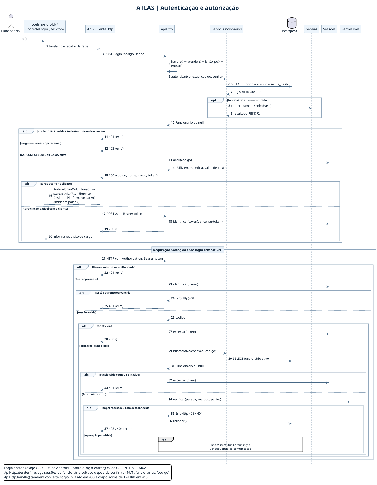
```plantuml
@startuml
title ATLAS | Autenticação e autorização
skinparam backgroundColor #FFFFFF
skinparam defaultFontName Arial
skinparam defaultFontColor #17283A
skinparam titleFontColor #112B46
skinparam titleFontSize 24
skinparam shadowing false
skinparam ArrowColor #466785
skinparam noteBackgroundColor #FFF6DB
skinparam noteBorderColor #AF9055
hide footbox
autonumber
skinparam sequence {
  ParticipantBackgroundColor #EDF5FC
  ParticipantBorderColor #527490
  LifeLineBorderColor #869CB1
  GroupBackgroundColor #F7FAFE
  GroupBorderColor #91A7BC
  DividerBackgroundColor #E7F0F9
  DividerBorderColor #8EA6BD
  MessageAlign left
}
skinparam maxMessageSize 240

actor Funcionário as F
participant "Login (Android) /\nControleLogin (Desktop)" as UI
participant "Api / ClienteHttp" as C
participant ApiHttp as H
participant "BancoFuncionarios" as B
database "PostgreSQL" as DB
participant Senhas as S
participant Sessoes as T
participant Permissoes as P

F -> UI : entrar()
UI ->> C : tarefa no executor de rede
C -> H : POST /login {codigo, senha}
H -> H : handle() → atender() → lerCorpo() → entrar()
H -> B : autenticar(conexao, codigo, senha)
B -> DB : SELECT funcionário ativo e senha_hash
DB --> B : registro ou ausência
opt funcionário ativo encontrado
  B -> S : conferir(senha, senhaHash)
  S --> B : resultado PBKDF2
end
B --> H : Funcionario ou null
alt credenciais inválidas, inclusive funcionário inativo
  H --> C : 401 {erro}
else cargo sem acesso operacional
  H --> C : 403 {erro}
else GARCOM, GERENTE ou CAIXA ativo
  H -> T : abrir(codigo)
  T --> H : UUID em memória, validade de 8 h
  H --> C : 200 {codigo, nome, cargo, token}
  alt cargo aceito no cliente
    C -->> UI : Android: runOnUiThread() → startActivity(Atendimento)\nDesktop: Platform.runLater() → Ambiente.painel()
  else cargo incompatível com o cliente
    C -> H : POST /sair, Bearer token
    H -> T : identificar(token), encerrar(token)
    H --> C : 200 {}
    C -->> UI : informa requisito de cargo
  end
end

== Requisição protegida após login compatível ==
C -> H : HTTP com Authorization: Bearer token
alt Bearer ausente ou malformado
  H --> C : 401 {erro}
else Bearer presente
  H -> T : identificar(token)
  alt sessão ausente ou vencida
    T --> H : ErroHttp(401)
    H --> C : 401 {erro}
  else sessão válida
    T --> H : codigo
    alt POST /sair
      H -> T : encerrar(token)
      H --> C : 200 {}
    else operação de negócio
      H -> B : buscarAtivo(conexao, codigo)
      B -> DB : SELECT funcionário ativo
      B --> H : Funcionario ou null
      alt funcionário tornou-se inativo
        H -> T : encerrar(token)
        H --> C : 401 {erro}
      else funcionário ativo
        H -> P : verificar(pessoa, metodo, partes)
        alt papel recusado / rota desconhecida
          P --> H : ErroHttp 403 / 404
          H -> DB : rollback()
          H --> C : 403 / 404 {erro}
        else operação permitida
          ref over H, DB : Dados.executar() e transação\nver sequência de comunicação
        end
      end
    end
  end
end
legend bottom left
  Login.entrar() exige GARCOM no Android. ControleLogin.entrar() exige GERENTE ou CAIXA.
  ApiHttp.atender() revoga sessões do funcionário editado depois de confirmar PUT /funcionarios/{codigo}.
  ApiHttp.handle() também converte corpo inválido em 400 e corpo acima de 128 KiB em 413.
endlegend
@enduml
```

## 21 · Abertura da comanda e consulta de consumo

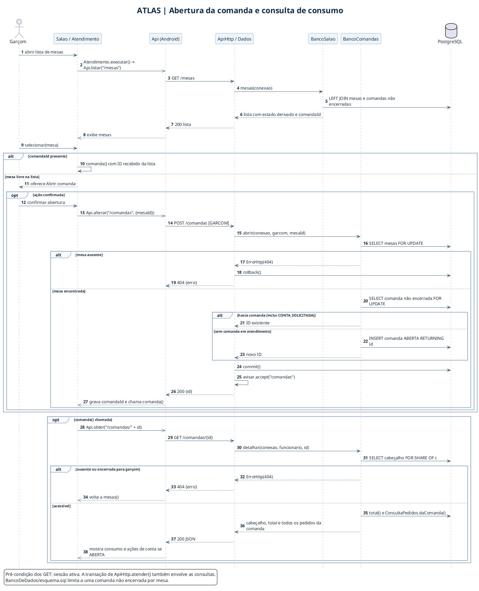
```plantuml
@startuml
title ATLAS | Abertura da comanda e consulta de consumo
skinparam backgroundColor #FFFFFF
skinparam defaultFontName Arial
skinparam defaultFontColor #17283A
skinparam titleFontColor #112B46
skinparam titleFontSize 24
skinparam shadowing false
skinparam ArrowColor #466785
skinparam noteBackgroundColor #FFF6DB
skinparam noteBorderColor #AF9055
hide footbox
autonumber
skinparam sequence {
  ParticipantBackgroundColor #EDF5FC
  ParticipantBorderColor #527490
  LifeLineBorderColor #869CB1
  GroupBackgroundColor #F7FAFE
  GroupBorderColor #91A7BC
  DividerBackgroundColor #E7F0F9
  DividerBorderColor #8EA6BD
  MessageAlign left
}
skinparam maxMessageSize 240

actor Garçom as G
participant "Salao / Atendimento" as S
participant "Api (Android)" as C
participant "ApiHttp / Dados" as H
participant BancoSalao as B
participant BancoComandas as D
database PostgreSQL as DB
G -> S : abrir lista de mesas
S ->> C : Atendimento.executar() → Api.listar("/mesas")
C -> H : GET /mesas
H -> B : mesas(conexao)
B -> DB : LEFT JOIN mesas e comandas não encerradas
B --> H : lista com estado derivado e comandaId
H --> C : 200 lista
C -->> S : exibe mesas
G -> S : selecionar(mesa)
alt comandaId presente
  S -> S : comanda() com ID recebido da lista
else mesa livre na lista
  S --> G : oferece Abrir comanda
  opt ação confirmada
    G -> S : confirmar abertura
    S ->> C : Api.alterar("/comandas", {mesaId})
    C -> H : POST /comandas [GARCOM]
    H -> D : abrir(conexao, garcom, mesaId)
    D -> DB : SELECT mesas FOR UPDATE
    alt mesa ausente
      D --> H : ErroHttp(404)
      H -> DB : rollback()
      H --> C : 404 {erro}
    else mesa encontrada
      D -> DB : SELECT comanda não encerrada FOR UPDATE
      alt havia comanda (inclui CONTA_SOLICITADA)
        D --> H : ID existente
      else sem comanda em atendimento
        D -> DB : INSERT comanda ABERTA RETURNING id
        D --> H : novo ID
      end
      H -> DB : commit()
      H -> H : avisar.accept("comandas")
      H --> C : 200 {id}
      C -->> S : grava comandaId e chama comanda()
    end
  end
end
opt comanda() chamada
  S ->> C : Api.obter("/comandas/" + id)
  C -> H : GET /comandas/{id}
  H -> D : detalhar(conexao, funcionario, id)
  D -> DB : SELECT cabeçalho FOR SHARE OF c
  alt ausente ou encerrada para garçom
    D --> H : ErroHttp(404)
    H --> C : 404 {erro}
    C -->> S : volta a mesas()
  else acessível
    D -> DB : total() e ConsultaPedidos.daComanda()
    D --> H : cabeçalho, total e todos os pedidos da comanda
    H --> C : 200 JSON
    C -->> S : mostra consumo e ações de conta se ABERTA
  end
end
legend bottom left
  Pré-condição dos GET: sessão ativa. A transação de ApiHttp.atender() também envolve as consultas.
  BancoDeDados/esquema.sql limita a uma comanda não encerrada por mesa.
endlegend
@enduml
```

## 22 · Montagem, envio e recuperação no Android

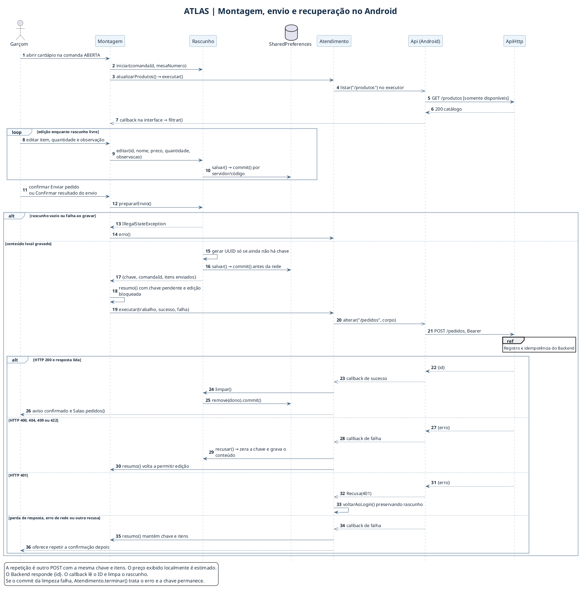
```plantuml
@startuml
title ATLAS | Montagem, envio e recuperação no Android
skinparam backgroundColor #FFFFFF
skinparam defaultFontName Arial
skinparam defaultFontColor #17283A
skinparam titleFontColor #112B46
skinparam titleFontSize 24
skinparam shadowing false
skinparam ArrowColor #466785
skinparam noteBackgroundColor #FFF6DB
skinparam noteBorderColor #AF9055
hide footbox
autonumber
skinparam sequence {
  ParticipantBackgroundColor #EDF5FC
  ParticipantBorderColor #527490
  LifeLineBorderColor #869CB1
  GroupBackgroundColor #F7FAFE
  GroupBorderColor #91A7BC
  DividerBackgroundColor #E7F0F9
  DividerBorderColor #8EA6BD
  MessageAlign left
}
skinparam maxMessageSize 240

actor Garçom as G
participant Montagem as M
participant Rascunho as R
database SharedPreferences as SP
participant "Atendimento" as A
participant "Api (Android)" as C
participant "ApiHttp" as H

G -> M : abrir cardápio na comanda ABERTA
M -> R : iniciar(comandaId, mesaNumero)
M -> A : atualizarProdutos() → executar()
A ->> C : listar("/produtos") no executor
C -> H : GET /produtos [somente disponíveis]
H --> C : 200 catálogo
C -->> M : callback na interface → filtrar()
loop edição enquanto rascunho livre
  G -> M : editar item, quantidade e observação
  M -> R : editar(id, nome, preco, quantidade, observacao)
  R -> SP : salvar() → commit() por servidor/código
end
G -> M : confirmar Enviar pedido\nou Confirmar resultado do envio
M -> R : prepararEnvio()
alt rascunho vazio ou falha ao gravar
  R --> M : IllegalStateException
  M -> A : erro()
else conteúdo local gravado
  R -> R : gerar UUID só se ainda não há chave
  R -> SP : salvar() → commit() antes da rede
  R --> M : {chave, comandaId, itens enviados}
  M -> M : resumo() com chave pendente e edição bloqueada
  M -> A : executar(trabalho, sucesso, falha)
  A ->> C : alterar("/pedidos", corpo)
  C -> H : POST /pedidos, Bearer
  ref over H : Registro e idempotência do Backend
  alt HTTP 200 e resposta lida
    H --> C : {id}
    C -->> A : callback de sucesso
    A -> R : limpar()
    R -> SP : remove(dono).commit()
    A --> G : aviso confirmado e Salao.pedidos()
  else HTTP 400, 404, 409 ou 422
    H --> C : {erro}
    C -->> A : callback de falha
    A -> R : recusar() → zera a chave e grava o conteúdo
    A -> M : resumo() volta a permitir edição
  else HTTP 401
    H --> C : {erro}
    C -->> A : Recusa(401)
    A -> A : voltarAoLogin() preservando rascunho
  else perda de resposta, erro de rede ou outra recusa
    C -->> A : callback de falha
    A -> M : resumo() mantém chave e itens
    A --> G : oferece repetir a confirmação depois
  end
end
legend bottom left
  A repetição é outro POST com a mesma chave e itens. O preço exibido localmente é estimado.
  O Backend responde {id}. O callback lê o ID e limpa o rascunho.
  Se o commit da limpeza falha, Atendimento.terminar() trata o erro e a chave permanece.
endlegend
@enduml
```

## 23 · Registro transacional e idempotência do pedido

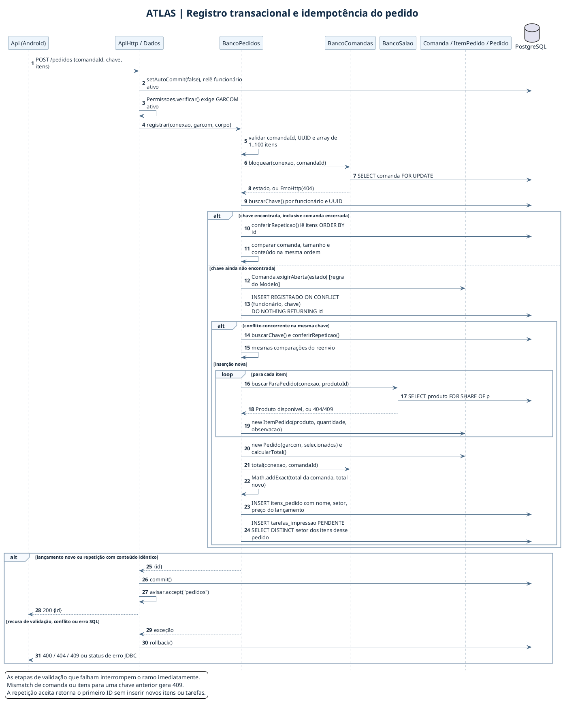
```plantuml
@startuml
title ATLAS | Registro transacional e idempotência do pedido
skinparam backgroundColor #FFFFFF
skinparam defaultFontName Arial
skinparam defaultFontColor #17283A
skinparam titleFontColor #112B46
skinparam titleFontSize 24
skinparam shadowing false
skinparam ArrowColor #466785
skinparam noteBackgroundColor #FFF6DB
skinparam noteBorderColor #AF9055
hide footbox
autonumber
skinparam sequence {
  ParticipantBackgroundColor #EDF5FC
  ParticipantBorderColor #527490
  LifeLineBorderColor #869CB1
  GroupBackgroundColor #F7FAFE
  GroupBorderColor #91A7BC
  DividerBackgroundColor #E7F0F9
  DividerBorderColor #8EA6BD
  MessageAlign left
}
skinparam maxMessageSize 240

participant "Api (Android)" as C
participant "ApiHttp / Dados" as H
participant BancoPedidos as P
participant BancoComandas as D
participant BancoSalao as B
participant "Comanda / ItemPedido / Pedido" as M
database PostgreSQL as DB

C -> H : POST /pedidos {comandaId, chave, itens}
H -> DB : setAutoCommit(false), relê funcionário ativo
H -> H : Permissoes.verificar() exige GARCOM ativo
H -> P : registrar(conexao, garcom, corpo)
P -> P : validar comandaId, UUID e array de 1..100 itens
P -> D : bloquear(conexao, comandaId)
D -> DB : SELECT comanda FOR UPDATE
D --> P : estado, ou ErroHttp(404)
P -> DB : buscarChave() por funcionário e UUID
alt chave encontrada, inclusive comanda encerrada
  P -> DB : conferirRepeticao() lê itens ORDER BY id
  P -> P : comparar comanda, tamanho e conteúdo na mesma ordem
else chave ainda não encontrada
  P -> M : Comanda.exigirAberta(estado) [regra do Modelo]
  P -> DB : INSERT REGISTRADO ON CONFLICT (funcionário, chave)\nDO NOTHING RETURNING id
  alt conflito concorrente na mesma chave
    P -> DB : buscarChave() e conferirRepeticao()
    P -> P : mesmas comparações do reenvio
  else inserção nova
    loop para cada item
      P -> B : buscarParaPedido(conexao, produtoId)
      B -> DB : SELECT produto FOR SHARE OF p
      B --> P : Produto disponível, ou 404/409
      P -> M : new ItemPedido(produto, quantidade, observacao)
    end
    P -> M : new Pedido(garcom, selecionados) e calcularTotal()
    P -> D : total(conexao, comandaId)
    P -> P : Math.addExact(total da comanda, total novo)
    P -> DB : INSERT itens_pedido com nome, setor, preço do lançamento
    P -> DB : INSERT tarefas_impressao PENDENTE\nSELECT DISTINCT setor dos itens desse pedido
  end
end
alt lançamento novo ou repetição com conteúdo idêntico
  P --> H : {id}
  H -> DB : commit()
  H -> H : avisar.accept("pedidos")
  H --> C : 200 {id}
else recusa de validação, conflito ou erro SQL
  P --> H : exceção
  H -> DB : rollback()
  H --> C : 400 / 404 / 409 ou status de erro JDBC
end
legend bottom left
  As etapas de validação que falham interrompem o ramo imediatamente.
  Mismatch de comanda ou itens para uma chave anterior gera 409.
  A repetição aceita retorna o primeiro ID sem inserir novos itens ou tarefas.
endlegend
@enduml
```

## 24 · HTTP, commit e notificações MQTT

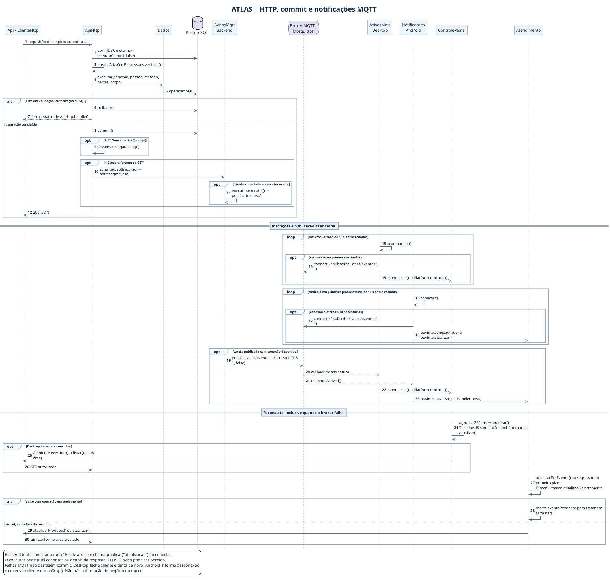
```plantuml
@startuml
title ATLAS | HTTP, commit e notificações MQTT
skinparam backgroundColor #FFFFFF
skinparam defaultFontName Arial
skinparam defaultFontColor #17283A
skinparam titleFontColor #112B46
skinparam titleFontSize 24
skinparam shadowing false
skinparam ArrowColor #466785
skinparam noteBackgroundColor #FFF6DB
skinparam noteBorderColor #AF9055
hide footbox
autonumber
skinparam sequence {
  ParticipantBackgroundColor #EDF5FC
  ParticipantBorderColor #527490
  LifeLineBorderColor #869CB1
  GroupBackgroundColor #F7FAFE
  GroupBorderColor #91A7BC
  DividerBackgroundColor #E7F0F9
  DividerBorderColor #8EA6BD
  MessageAlign left
}
skinparam maxMessageSize 240

participant "Api / ClienteHttp" as C
participant ApiHttp as H
participant Dados as D
database PostgreSQL as DB
participant "AvisosMqtt\nBackend" as S
queue "Broker MQTT\n(Mosquitto)" as Q
participant "AvisosMqtt\nDesktop" as FX
participant "Notificacoes\nAndroid" as M
participant "ControlePainel" as P
participant "Atendimento" as A

C -> H : requisição de negócio autenticada
H -> DB : abrir JDBC e chamar setAutoCommit(false)
H -> H : buscarAtivo() e Permissoes.verificar()
H -> D : executar(conexao, pessoa, metodo, partes, corpo)
D -> DB : operação SQL
alt erro em validação, autorização ou SQL
  H -> DB : rollback()
  H --> C : {erro}, status de ApiHttp.handle()
else transação concluída
  H -> DB : commit()
  opt PUT /funcionarios/{codigo}
    H -> H : sessoes.revogar(codigo)
  end
  opt método diferente de GET
    H -> S : avisar.accept(recurso) → notificar(recurso)
    opt cliente conectado e executor aceita
      S ->> S : executor.execute(() -> publicar(recurso))
    end
  end
  H --> C : 200 JSON
end

== Inscrições e publicação assíncrona ==
loop Desktop: atraso de 10 s entre rodadas
  FX -> FX : acompanhar()
  opt reconexão ou primeira assinatura
    FX -> Q : connect() / subscribe("atlas/eventos", 1)
    FX ->> P : mudou.run() → Platform.runLater()
  end
end
loop Android em primeiro plano: atraso de 15 s entre rodadas
  M -> M : conectar()
  opt conexão e assinatura necessárias
    M -> Q : connect() / subscribe("atlas/eventos", 1)
    M ->> A : ouvinte.conexao(true) e ouvinte.atualizar()
  end
end
opt tarefa publicada com conexão disponível
  S -> Q : publish("atlas/eventos", recurso UTF-8, 1, false)
  Q -->> FX : callback de assinatura
  Q -->> M : messageArrived()
  FX ->> P : mudou.run() → Platform.runLater()
  M ->> A : ouvinte.atualizar() → Handler.post()
end

== Reconsulta, inclusive quando o broker falha ==
P -> P : agrupar 250 ms → atualizar()\nTimeline 45 s ou botão também chama atualizar()
opt Desktop livre para consultar
  P -> C : Ambiente.executar() → listar(rota da área)
  C -> H : GET autorizado
end
A -> A : atualizarPorEvento() ao regressar ao primeiro plano\nO menu chama atualizar() diretamente
alt aviso com operação em andamento
  A -> A : marca eventoPendente para tratar em terminar()
else visível, aviso fora do resumo
  A -> C : atualizarProdutos() ou atualizar()
  C -> H : GET conforme área e estado
end

legend bottom left
  Backend tenta conectar a cada 15 s de atraso e chama publicar("atualizacao") ao conectar.
  O executor pode publicar antes ou depois da resposta HTTP. O aviso pode ser perdido.
  Falhas MQTT não desfazem commit. Desktop fecha cliente e tenta de novo. Android informa desconexão
  e encerra o cliente em onStop(). Não há confirmação de negócio no tópico.
endlegend
@enduml
```

## 25 · Encaminhamento de comprovantes para Bar e Cozinha

```plantuml
@startuml
title ATLAS | Encaminhamento de comprovantes para Bar e Cozinha
skinparam backgroundColor #FFFFFF
skinparam defaultFontName Arial
skinparam defaultFontColor #17283A
skinparam titleFontColor #112B46
skinparam titleFontSize 24
skinparam shadowing false
skinparam ArrowColor #466785
skinparam noteBackgroundColor #FFF6DB
skinparam noteBorderColor #AF9055
hide footbox
autonumber
skinparam sequence {
  ParticipantBackgroundColor #EDF5FC
  ParticipantBorderColor #527490
  LifeLineBorderColor #869CB1
  GroupBackgroundColor #F7FAFE
  GroupBorderColor #91A7BC
  DividerBackgroundColor #E7F0F9
  DividerBorderColor #8EA6BD
  MessageAlign left
}
skinparam maxMessageSize 240

participant BancoPedidos as B
database PostgreSQL as DB
actor Gerente as G
participant "ControlePainel / Secoes" as P
participant ClienteHttp as C
participant "ApiHttp / Dados" as H
participant BancoImpressoes as I
participant "FilaProducao" as F
participant "Impressao / Java Print Service" as J
queue "Fila do SO\nselecionada por setor" as Q

B -> DB : registrar() → INSERT DISTINCT (pedido_id, setor, PENDENTE)
note over B, DB
  Mesma transação dos itens. Uma tarefa por setor presente.
  Pedido misto gera uma para BAR e outra para COZINHA.
end note
H -> DB : ApiHttp.atender() confirma a transação
G -> P : abrir Produção e impressão
P -> P : Secoes.producao() seleciona rota /impressoes
P ->> C : atualizar() → Ambiente.executar() → listar(rota)
C -> H : GET /impressoes [GERENTE]
H -> I : listar(conexao)
I -> DB : JOIN itens por pedido_id e setor da tarefa
I -> I : agrupa por id e monta texto por setor
I --> H : tarefas com estado, tentativa, setor, texto e detalhe
H --> C : 200 lista
C -->> P : Secoes.preencher() → ControleListagem.preencher()
opt operador pede envio de tarefa selecionada
  G -> P : Imprimir / Tentar novamente
  P -> F : imprimir(tarefa)
  F -> F : Preferencias.impressora(setor)
  alt BAR
    F -> F : lê fila.BAR
  else COZINHA
    F -> F : lê fila.COZINHA
  end
  alt não configurada
    F --> G : aviso para escolher a fila do setor
  else configurada e operador confirma
    ref over F, Q : localizar(), reservar e enviar via Java Print Service\nver sequência de impressão
  end
end
legend bottom left
  Bar e Cozinha designam setores dos itens e destinos de fila no Desktop.
  Qualquer entrega física depende da fila, driver e dispositivo configurados.
endlegend
@enduml
```

## 26 · Atualização do preparo e registro da entrega

```plantuml
@startuml
title ATLAS | Atualização do preparo e registro da entrega
skinparam backgroundColor #FFFFFF
skinparam defaultFontName Arial
skinparam defaultFontColor #17283A
skinparam titleFontColor #112B46
skinparam titleFontSize 24
skinparam shadowing false
skinparam ArrowColor #466785
skinparam noteBackgroundColor #FFF6DB
skinparam noteBorderColor #AF9055
hide footbox
autonumber
skinparam sequence {
  ParticipantBackgroundColor #EDF5FC
  ParticipantBorderColor #527490
  LifeLineBorderColor #869CB1
  GroupBackgroundColor #F7FAFE
  GroupBorderColor #91A7BC
  DividerBackgroundColor #E7F0F9
  DividerBorderColor #8EA6BD
  MessageAlign left
}
skinparam maxMessageSize 240

actor Gerente as G
participant "Secoes / Operacoes\nDesktop" as D
participant "ClienteHttp / Api" as C
participant "ApiHttp / Dados" as H
participant BancoPedidos as B
database PostgreSQL as DB
participant "Salao / Atendimento\nAndroid" as A
actor Garçom as W

G -> D : abre Pedidos e escolhe REGISTRADO
D -> C : ControlePainel.atualizar() → listar("/pedidos")
C -> H : GET /pedidos [GERENTE, sem filtro de autor]
H --> C : pedidos com itens e estado
C -->> D : mostra pedidos não ENTREGUE
G -> D : Marcar como pronto
D -> D : pronto(linha) → salvar()
D ->> C : ControlePainel.executar() → ClienteHttp.alterar()
C -> H : POST /pedidos/{id}/pronto
H -> B : marcarPronto(conexao, id)
B -> DB : UPDATE → PRONTO, WHERE estado = REGISTRADO
alt linha alterada
  H -> DB : commit()
  H -> H : avisar.accept("pedidos")
  H --> C : 200 {id}
  C -->> D : mensagem e concluirAcao() → atualizar()
else UPDATE sem linha correspondente
  H -> DB : rollback()
  H --> C : 409 se UPDATE não retornou linha
end

W -> A : Meus pedidos
A ->> C : Salao.pedidos() → executar() → Api.listar()
C -> H : GET /pedidos [GARCOM]
H -> DB : ConsultaPedidos.listar() filtra pelo código do garçom
H --> C : 200 lista
C -->> A : exibe pedidos próprios
W -> A : abre detalhes e escolhe Marcar entregue [PRONTO]
A ->> C : Salao.detalhes() → executar() → Api.alterar()
C -> H : POST /pedidos/{id}/entregar
H -> B : entregar(conexao, id, garcom)
B -> DB : UPDATE → ENTREGUE, WHERE PRONTO e autor = garçom
alt linha alterada
  H -> DB : commit()
  H -> H : avisar.accept("pedidos")
  H --> C : 200 {id}
  C -->> A : aviso e pedidos()
else sem linha correspondente
  H -> DB : rollback()
  H --> C : 409 {erro}
  C -->> A : erro()
end
legend bottom left
  Secoes.pedidos() oferece a ação PRONTO após carregar a lista.
  PRONTO é do pedido inteiro. As tarefas de impressão seguem estados próprios.
endlegend
@enduml
```

## 27 · Impressão manual e registro do envio

```plantuml
@startuml
title ATLAS | Impressão manual e registro do envio
skinparam backgroundColor #FFFFFF
skinparam defaultFontName Arial
skinparam defaultFontColor #17283A
skinparam titleFontColor #112B46
skinparam titleFontSize 24
skinparam shadowing false
skinparam ArrowColor #466785
skinparam noteBackgroundColor #FFF6DB
skinparam noteBorderColor #AF9055
hide footbox
autonumber
skinparam sequence {
  ParticipantBackgroundColor #EDF5FC
  ParticipantBorderColor #527490
  LifeLineBorderColor #869CB1
  GroupBackgroundColor #F7FAFE
  GroupBorderColor #91A7BC
  DividerBackgroundColor #E7F0F9
  DividerBorderColor #8EA6BD
  MessageAlign left
}
skinparam maxMessageSize 240

actor Gerente as G
participant FilaProducao as F
participant "ControlePainel / Ambiente" as A
participant ClienteHttp as C
participant "ApiHttp / Dados" as H
participant BancoImpressoes as B
database PostgreSQL as DB
participant Impressao as I
queue "PrintService / DocPrintJob\nfila do sistema" as Q

G -> F : imprimir(tarefa PENDENTE ou FALHA)
F -> F : lê Preferencias.impressora(setor)
alt sem nome configurado
  F --> G : aviso de fila sem configuração
else fila configurada
  F --> G : pede confirmação de envio
  opt gerente confirma
    G -> F : Enviar
    F -> A : executar(trabalho, sucesso)
    A ->> F : tarefa no executor HTTP
    F -> I : localizar(nome)
    I -> Q : PrintServiceLookup.lookupPrintServices(PRINTABLE)
    alt fila compatível ausente
      I --> F : IllegalArgumentException
      F -->> A : operação não concluída antes da reserva
    else fila localizada
      F -> C : alterar("POST", rota + "/reservar", reserva)
      C -> H : POST /impressoes/{id}/reservar\n{} ou {repetir:true,tentativa anterior}
      H -> B : reservar(conexao, gerente, id, dados)
      B -> DB : UPDATE condicional PENDENTE/0 ou FALHA/atual\n→ EM_TENTATIVA, incrementa tentativa
      alt reserva aceita e resposta recebida
        H -> DB : commit()
        H --> C : 200 {id,tentativa}
        C --> F : número da tentativa
        F -> I : enviar(fila, titulo, texto)
        I -> Q : fila.createPrintJob() → trabalho.print(SimpleDoc, atributos)
        alt retorno normal
          Q --> I : retorno de print()
          I --> F : define ENVIADA
        else exceção durante o envio
          I --> F : define INCERTA e solicita conferência
        end
        F -> F : resultado(api, rota, tentativa, estado, detalhe, false)
        F -> C : api.alterar("POST", rota + "/resultado", dados)
        C -> H : POST /impressoes/{id}/resultado
        H -> B : registrarResultado(conexao, gerente, id, dados)
        B -> DB : UPDATE condicionado à tentativa, estado e responsável
        alt resultado aceito e resposta recebida
          H -> DB : commit()
          H --> C : 200 {id}
          F -->> A : mostra detalhe local da tentativa
        else recusa ou falha na resposta do resultado
          F -->> A : informa conferir a fila e registrar resultado
        end
      else 409 na reserva ou resposta da reserva perdida
        F -->> A : erro da reserva antes do envio ao SO
      end
    end
  end
end
legend bottom left
  BancoImpressoes.reservar() redefine detalhe e confirmado_por. A página é um Printable
  que delega a Impressao.desenhar(). ENVIADA indica o retorno da chamada à fila do SO.
  Resposta HTTP perdida pode ocultar um commit. A conferência usa o estado lido da API.
endlegend
@enduml
```

## 28 · Conferência e repetição de impressão

```plantuml
@startuml
title ATLAS | Conferência e repetição de impressão
skinparam backgroundColor #FFFFFF
skinparam defaultFontName Arial
skinparam defaultFontColor #17283A
skinparam titleFontColor #112B46
skinparam titleFontSize 24
skinparam shadowing false
skinparam ArrowColor #466785
skinparam noteBackgroundColor #FFF6DB
skinparam noteBorderColor #AF9055
hide footbox
autonumber
skinparam sequence {
  ParticipantBackgroundColor #EDF5FC
  ParticipantBorderColor #527490
  LifeLineBorderColor #869CB1
  GroupBackgroundColor #F7FAFE
  GroupBorderColor #91A7BC
  DividerBackgroundColor #E7F0F9
  DividerBorderColor #8EA6BD
  MessageAlign left
}
skinparam maxMessageSize 240

actor Gerente as G
participant FilaProducao as F
participant "ControlePainel / Ambiente" as A
participant ClienteHttp as C
participant "ApiHttp / Dados" as H
participant BancoImpressoes as B
database PostgreSQL as DB

G -> F : conferir(tarefa em EM_TENTATIVA ou INCERTA)
F --> G : ChoiceDialog de resultado (sem opção pré-selecionada)
note over G, F
  EM_TENTATIVA: desconhecido, envio confirmado na fila, ou falha antes do envio.
  INCERTA: apenas confirmação de envio ou falha.
end note
alt operador cancela
  F --> G : encerra diálogo sem alterar tarefa
else operador informa resultado
  G -> F : confirma escolha
  F -> A : painel.executar()
  A ->> F : tarefa no executor chama resultado(..., true)
  F -> C : api.alterar("POST", rota + "/resultado", dados)
  C -> H : POST /impressoes/{id}/resultado
  H -> B : registrarResultado(conexao, gerente, id, dados)
  B -> B : Campos valida estado, tentativa e detalhe obrigatório
  B -> DB : UPDATE para a mesma tentativa\nEM_TENTATIVA ou INCERTA para ENVIADA/FALHA,\nou repetição exata aceita
  alt atualização aceita
    H -> DB : commit()
    H --> C : 200 {id}
    C -->> F : mensagem e atualizar a listagem
    opt FALHA e nova tentativa iniciada pelo gerente
      G -> F : Tentar novamente
      ref over F, DB : reservar com repetir=true e número anterior\nver sequência de impressão
    end
  else solicitação inválida ou tarefa mudou
    H -> DB : rollback()
    H --> C : 400 ou 409 {erro}
    C -->> A : Operação não concluída
  end
end
legend bottom left
  A conferência explícita permite outro gerente e registra confirmado_por.
  A repetição exata confere estado, detalhe e autor do resultado, além de id e tentativa.
  Conferir altera o registro no Backend. O reenvio à fila exige outra ação e outra reserva.
endlegend
@enduml
```

## 29 · Solicitação da conta, pagamento e liberação da mesa

```plantuml
@startuml
title ATLAS | Solicitação da conta, pagamento e liberação da mesa
skinparam backgroundColor #FFFFFF
skinparam defaultFontName Arial
skinparam defaultFontColor #17283A
skinparam titleFontColor #112B46
skinparam titleFontSize 24
skinparam shadowing false
skinparam ArrowColor #466785
skinparam noteBackgroundColor #FFF6DB
skinparam noteBorderColor #AF9055
hide footbox
autonumber
skinparam sequence {
  ParticipantBackgroundColor #EDF5FC
  ParticipantBorderColor #527490
  LifeLineBorderColor #869CB1
  GroupBackgroundColor #F7FAFE
  GroupBorderColor #91A7BC
  DividerBackgroundColor #E7F0F9
  DividerBorderColor #8EA6BD
  MessageAlign left
}
skinparam maxMessageSize 240

actor Garçom as G
participant "Salao / Api\nAndroid" as M
participant "ApiHttp / Dados" as H
participant BancoComandas as B
database PostgreSQL as DB
participant "Comanda / Pagamento\nModelo" as J
participant "Secoes / Operacoes /\nClienteHttp (Desktop)" as D
participant Formularios as F
actor "Caixa ou gerente" as C

G -> M : confirmar Solicitar conta [comanda ABERTA na UI]
M -> H : POST /comandas/{id}/solicitar [GARCOM]
H -> B : solicitar(conexao, id)
B -> DB : UPDATE ABERTA ou CONTA_SOLICITADA → CONTA_SOLICITADA
alt em atendimento
  H -> DB : commit()
  H -> H : avisar.accept("comandas")
  H --> M : 200 {id}, seguido por comanda() no Android
else ausente ou encerrada
  H -> DB : rollback()
  H --> M : 409 {erro}
end

C -> D : abrir Financeiro
D -> H : GET /comandas [GERENTE ou CAIXA]
H -> B : listar(conexao, funcionario)
B -> DB : consulta com totais em centavos
H --> D : lista filtrada no Desktop por Secoes.contas(false)
C -> D : Receber e fechar (CONTA_SOLICITADA)
D -> F : pagamento(janela, linha)
F --> C : total integral e forma DINHEIRO, CARTAO ou PIX
alt cancela formulário
  F --> D : Optional.empty()
else confirma formulário
  F --> D : {valorCentavos: total exibido, forma}
  D -> H : POST /comandas/{id}/pagar [GERENTE ou CAIXA]
  H -> B : pagar(conexao, funcionario, id, dados)
  B -> DB : bloquear() → SELECT comanda FOR UPDATE
  B -> J : new Pagamento(valor, forma)
  B -> DB : total() → soma itens persistidos ou zero
  B -> J : Comanda.validarPagamento(estado, total, pagamento)
  alt comanda solicitada e valor exato
    B -> DB : INSERT pagamentos
    B -> DB : UPDATE comandas → ENCERRADA, encerramento = agora
    H -> DB : commit() de ambas as escritas
    H -> H : avisar.accept("comandas")
    H --> D : 200 {id}, seguido por mensagem e atualizar() no Desktop
  else recusa ou falha
    H -> DB : rollback()
    H --> D : 404 ausente, 409 estado ou 400 valor/forma\nErro SQL usa o status de ApiHttp.erroBanco()
  end
end
note over H, DB
  GET /mesas deixa de vincular a comanda encerrada pelo LEFT JOIN.
  Mesa sem outra comanda em atendimento aparece LIVRE.
  O pagamento é registrado localmente. A validação não consulta preparo nem impressão.
end note
@enduml
```

## 30 · Casos de uso · atendimento Android

```plantuml
@startuml
title ATLAS | Casos de uso · atendimento Android
skinparam backgroundColor #FFFFFF
skinparam defaultFontName Arial
skinparam defaultFontColor #17283A
skinparam titleFontColor #112B46
skinparam titleFontSize 24
skinparam shadowing false
skinparam ArrowColor #466785
skinparam noteBackgroundColor #FFF6DB
skinparam noteBorderColor #AF9055
skinparam packageStyle rectangle
skinparam componentStyle uml2
skinparam componentBackgroundColor #EEF5FC
skinparam componentBorderColor #527490
skinparam rectangleBackgroundColor #F6F9FD
skinparam rectangleBorderColor #91A7BC
skinparam usecaseBackgroundColor #EDF5FC
skinparam usecaseBorderColor #527490
skinparam stateBackgroundColor #EDF5FC
skinparam stateBorderColor #527490
skinparam classBackgroundColor #F6F9FD
skinparam classBorderColor #527490
skinparam classAttributeIconSize 0
skinparam nodesep 32
skinparam ranksep 48

left to right direction
actor "Garçom ativo" as G
actor "Operador do aparelho" as O
rectangle "ATLAS · Android e API" {
  usecase "Configurar rede do Android" as Rede
  usecase "Entrar e sair" as Sessao
  usecase "Consultar mesas e consumo\nde comandas em atendimento" as Consumo
  usecase "Abrir comanda para a mesa" as Abrir
  usecase "Consultar e filtrar\ncardápio disponível" as Menu
  usecase "Montar, retomar ou\ndescartar rascunho local" as Ras
  usecase "Enviar pedido ou repetir\numa tentativa pendente" as Enviar
  usecase "Consultar pedidos próprios" as Ped
  usecase "Registrar entrega de\npedido próprio pronto" as Ent
  usecase "Solicitar a conta da comanda" as Conta
}
O -- Rede
G -- Sessao
G -- Consumo
G -- Abrir
G -- Menu
G -- Ras
G -- Enviar
G -- Ped
G -- Ent
G -- Conta
note bottom of Ras
  Descarte disponível sem envio pendente.
  O rascunho é identificado por servidor e código.
end note
note bottom of Consumo
  Consumo inclui todos os pedidos da comanda.
  A listagem Meus pedidos filtra pelo garçom.
end note
@enduml
```

## 31 · Casos de uso · salão, caixa e histórico no Desktop

```plantuml
@startuml
title ATLAS | Casos de uso · salão, caixa e histórico no Desktop
skinparam backgroundColor #FFFFFF
skinparam defaultFontName Arial
skinparam defaultFontColor #17283A
skinparam titleFontColor #112B46
skinparam titleFontSize 24
skinparam shadowing false
skinparam ArrowColor #466785
skinparam noteBackgroundColor #FFF6DB
skinparam noteBorderColor #AF9055
skinparam packageStyle rectangle
skinparam componentStyle uml2
skinparam componentBackgroundColor #EEF5FC
skinparam componentBorderColor #527490
skinparam rectangleBackgroundColor #F6F9FD
skinparam rectangleBorderColor #91A7BC
skinparam usecaseBackgroundColor #EDF5FC
skinparam usecaseBorderColor #527490
skinparam stateBackgroundColor #EDF5FC
skinparam stateBorderColor #527490
skinparam classBackgroundColor #F6F9FD
skinparam classBorderColor #527490
skinparam classAttributeIconSize 0
skinparam nodesep 32
skinparam ranksep 48

left to right direction
actor "Gerente ativo" as G
actor "Caixa ativo" as C
actor "Operador de salão e caixa" as Comum <<abstrato>>
actor "Operador do computador" as O
rectangle "ATLAS · Desktop e API" {
  usecase "Configurar conexão HTTP\nna tela de login" as Rede
  usecase "Entrar e sair" as Sessao
  usecase "Consultar salão e\nconsumo da comanda" as Salao
  usecase "Consultar contas\nem atendimento" as Fin
  usecase "Registrar recebimento integral\ne encerrar comanda" as Pagar
  usecase "Consultar histórico\nde comandas encerradas" as Hist
  usecase "Consultar pedidos entregues" as HP
  usecase "Consultar panorama operacional" as Inicio
}
G --|> Comum
C --|> Comum
O -- Rede
Comum -- Sessao
Comum -- Salao
Comum -- Fin
Comum -- Pagar
Comum -- Hist
G -- HP
G -- Inicio
note bottom of Pagar
  Exige CONTA_SOLICITADA e valor integral.
  Encerramento e liberação são efeitos do pagamento.
end note
@enduml
```

## 32 · Casos de uso · gestão, produção e acesso inicial

```plantuml
@startuml
title ATLAS | Casos de uso · gestão, produção e acesso inicial
skinparam backgroundColor #FFFFFF
skinparam defaultFontName Arial
skinparam defaultFontColor #17283A
skinparam titleFontColor #112B46
skinparam titleFontSize 24
skinparam shadowing false
skinparam ArrowColor #466785
skinparam noteBackgroundColor #FFF6DB
skinparam noteBorderColor #AF9055
skinparam packageStyle rectangle
skinparam componentStyle uml2
skinparam componentBackgroundColor #EEF5FC
skinparam componentBorderColor #527490
skinparam rectangleBackgroundColor #F6F9FD
skinparam rectangleBorderColor #91A7BC
skinparam usecaseBackgroundColor #EDF5FC
skinparam usecaseBorderColor #527490
skinparam stateBackgroundColor #EDF5FC
skinparam stateBorderColor #527490
skinparam classBackgroundColor #F6F9FD
skinparam classBorderColor #527490
skinparam classAttributeIconSize 0
skinparam nodesep 32
skinparam ranksep 48

left to right direction
actor "Gerente ativo" as G
actor "Operador de implantação" as O
rectangle "ATLAS · administração" {
  usecase "Cadastrar mesa" as Mesa
  usecase "Consultar, cadastrar\ne editar produtos" as Produto
  usecase "Consultar, cadastrar\ne editar funcionários" as Func
  usecase "Acompanhar pedidos\nem andamento" as Ped
  usecase "Marcar pedido registrado\ncomo pronto" as Pronto
  usecase "Configurar conexão e\nfilas do Bar e da Cozinha" as Config
  usecase "Consultar tarefas e\nver comprovante por setor" as Tarefas
  usecase "Enviar comprovante\nà fila do setor" as Print
  usecase "Conferir resultado\nda tentativa" as Conferir
  usecase "Repetir envio de tarefa\nem FALHA" as Retry
  usecase "Cadastrar primeiro\ngerente pelo console" as Boot
}
G -- Mesa
G -- Produto
G -- Func
G -- Ped
G -- Pronto
G -- Config
G -- Tarefas
G -- Print
G -- Conferir
G -- Retry
O -- Boot
note bottom of Boot
  Servidor.main("criar-gerente"), console interativo
  e tabela de funcionários vazia.
end note
note bottom of Conferir
  A interface oferece conferência em
  EM_TENTATIVA ou INCERTA.
end note
@enduml
```

## 33 · Componentes e interfaces em operação

```plantuml
@startuml
title ATLAS | Componentes e interfaces em operação
skinparam backgroundColor #FFFFFF
skinparam defaultFontName Arial
skinparam defaultFontColor #17283A
skinparam titleFontColor #112B46
skinparam titleFontSize 24
skinparam shadowing false
skinparam ArrowColor #466785
skinparam noteBackgroundColor #FFF6DB
skinparam noteBorderColor #AF9055
skinparam packageStyle rectangle
skinparam componentStyle uml2
skinparam componentBackgroundColor #EEF5FC
skinparam componentBorderColor #527490
skinparam rectangleBackgroundColor #F6F9FD
skinparam rectangleBorderColor #91A7BC
skinparam usecaseBackgroundColor #EDF5FC
skinparam usecaseBorderColor #527490
skinparam stateBackgroundColor #EDF5FC
skinparam stateBorderColor #527490
skinparam classBackgroundColor #F6F9FD
skinparam classBorderColor #527490
skinparam classAttributeIconSize 0
skinparam nodesep 32
skinparam ranksep 48

top to bottom direction
package "Clientes ATLAS" {
  component "Android\nMobile · Java e layouts XML" as Android
  component "Desktop\nJavaFX · FXML" as Desktop {
    component "Fila de produção\nSecoes e FilaProducao" as Fila
    component "Impressão local\nImpressao" as Print
  }
}
package "Servidor ATLAS" {
  component "Backend Java\nServidor e ApiHttp" as Backend
  component "Operações JDBC\nDados, Banco*, Consultas" as Data
  component "Publicador\nAvisosMqtt" as Pub
  component "Modelo Java\nvalidação e permissões" as Modelo
}
interface "API HTTP/JSON\nBearer nas rotas protegidas" as API
queue "Broker MQTT\nMosquitto compatível" as Broker
database "PostgreSQL\nBancoDeDados/esquema.sql" as Pg
interface "Java Print Service\nPRINTABLE" as JPS
queue "Fila do SO\nnome configurado para BAR" as Bar
queue "Fila do SO\nnome configurado para COZINHA" as Coz

Android ..> API : Api · HttpURLConnection
Desktop ..> API : ClienteHttp · HttpClient\nFila: listar, reservar, informar resultado
API -- Backend : fornecida por ApiHttp
Android ..> Broker : Paho subscribe · Notificacoes
Desktop ..> Broker : Paho subscribe · AvisosMqtt
Backend ..> Data : Dados.executar()
Backend ..> Pub : Consumer<String>
Backend ..> Modelo : Funcionario
Data ..> Modelo : regras e objetos
Data --> Pg : JDBC / pgJDBC
Pub --> Broker : publish · atlas/eventos\nQoS 1, sem retenção
Fila ..> Print : localizar() / enviar()
Print ..> JPS : lookup / print()
JPS -- Bar
JPS -- Coz
note bottom of JPS
  Filas são nomes configuráveis em Preferencias
  e podem coincidir. A interface confirma o
  retorno de print(), sem telemetria do papel.
end note
note bottom of Pg
  A API coordena transações.
  Sessoes mantém tokens em memória no Backend.
end note
@enduml
```

## 34 · Esquema PostgreSQL · tabelas e cardinalidades

```plantuml
@startuml
title ATLAS | Esquema PostgreSQL · tabelas e cardinalidades
skinparam backgroundColor #FFFFFF
skinparam defaultFontName Arial
skinparam defaultFontColor #17283A
skinparam titleFontColor #112B46
skinparam titleFontSize 24
skinparam shadowing false
skinparam ArrowColor #466785
skinparam noteBackgroundColor #FFF6DB
skinparam noteBorderColor #AF9055
skinparam packageStyle rectangle
skinparam componentStyle uml2
skinparam componentBackgroundColor #EEF5FC
skinparam componentBorderColor #527490
skinparam rectangleBackgroundColor #F6F9FD
skinparam rectangleBorderColor #91A7BC
skinparam usecaseBackgroundColor #EDF5FC
skinparam usecaseBorderColor #527490
skinparam stateBackgroundColor #EDF5FC
skinparam stateBorderColor #527490
skinparam classBackgroundColor #F6F9FD
skinparam classBorderColor #527490
skinparam classAttributeIconSize 0
skinparam nodesep 32
skinparam ranksep 48

hide circle
skinparam linetype polyline
entity funcionarios {
  * codigo : varchar(32) <<PK>>
  --
  * nome : varchar(120)
  * cargo : varchar(24)
  * ativo : boolean
  * senha_hash : text
}
entity mesas {
  * id : integer <<PK, identity>>
  --
  * numero : integer <<UQ>>
}
entity categorias {
  * id : integer <<PK, identity>>
  --
  * nome : varchar(120) <<UQ>>
}
entity produtos {
  * id : integer <<PK, identity>>
  --
  * nome : varchar(120)
  * categoria_id : integer <<FK>>
  * preco_centavos : bigint
  * setor : varchar(10)
  * disponivel : boolean
}
entity comandas {
  * id : integer <<PK, identity>>
  --
  * mesa_id : integer <<FK>>
  * funcionario_codigo : varchar(32) <<FK>>
  * estado : varchar(20)
  * abertura : timestamptz = current_timestamp
    encerramento : timestamptz
}
entity pedidos {
  * id : integer <<PK, identity>>
  --
  * comanda_id : integer <<FK>>
  * funcionario_codigo : varchar(32) <<FK>>
  * chave : uuid
  * estado : varchar(20)
  * criacao : timestamptz = current_timestamp
}
entity itens_pedido {
  * id : integer <<PK, identity>>
  --
  * pedido_id : integer <<FK>>
  * produto_id : integer <<FK>>
  * nome : varchar(120)
  * setor : varchar(10)
  * preco_centavos : bigint
  * quantidade : integer
  * observacao : varchar(240) = ''
}
entity pagamentos {
  * comanda_id : integer <<PK, FK>>
  --
  * funcionario_codigo : varchar(32) <<FK>>
  * valor_centavos : bigint
  * forma : varchar(20)
  * registro : timestamptz = current_timestamp
}
entity tarefas_impressao {
  * id : integer <<PK, identity>>
  --
  * pedido_id : integer <<FK>>
  * setor : varchar(10)
  * estado : varchar(20)
  * tentativa : integer = 0
    responsavel_codigo : varchar(32) <<FK>>
    confirmado_por : varchar(32) <<FK>>
  * detalhe : varchar(500) = ''
}
mesas ||--o{ comandas : mesa_id
funcionarios ||--o{ comandas : abertura
funcionarios ||--o{ pedidos : autoria
comandas ||--o{ pedidos : comanda_id
categorias ||--o{ produtos : categoria_id
produtos ||--o{ itens_pedido : produto_id
pedidos ||--o{ itens_pedido : pedido_id
comandas ||--o| pagamentos : comanda_id
funcionarios ||--o{ pagamentos : recebimento
pedidos ||--o{ tarefas_impressao : pedido_id
funcionarios |o--o{ tarefas_impressao : responsavel_codigo
funcionarios |o--o{ tarefas_impressao : confirmado_por
legend bottom left
  * obrigatório · PK chave primária · FK chave estrangeira · UQ único
  comandas: índice único parcial (mesa_id) em estado diferente de ENCERRADA.
  pedidos: UNIQUE (funcionario_codigo, chave).
  tarefas_impressao: UNIQUE (pedido_id, setor) e CHECK do setor (BAR ou COZINHA)
  limitam a 0..2 por pedido no SQL. O lançamento JDBC gera 1..2 para pedidos aceitos.
  O SQL não exige 1..100 linhas por pedido. Esse limite vem do registro Java.
endlegend
@enduml
```

## 35 · Estados persistidos da comanda e situação da mesa

```plantuml
@startuml
title ATLAS | Estados persistidos da comanda e situação da mesa
skinparam backgroundColor #FFFFFF
skinparam defaultFontName Arial
skinparam defaultFontColor #17283A
skinparam titleFontColor #112B46
skinparam titleFontSize 24
skinparam shadowing false
skinparam ArrowColor #466785
skinparam noteBackgroundColor #FFF6DB
skinparam noteBorderColor #AF9055
skinparam packageStyle rectangle
skinparam componentStyle uml2
skinparam componentBackgroundColor #EEF5FC
skinparam componentBorderColor #527490
skinparam rectangleBackgroundColor #F6F9FD
skinparam rectangleBorderColor #91A7BC
skinparam usecaseBackgroundColor #EDF5FC
skinparam usecaseBorderColor #527490
skinparam stateBackgroundColor #EDF5FC
skinparam stateBorderColor #527490
skinparam classBackgroundColor #F6F9FD
skinparam classBorderColor #527490
skinparam classAttributeIconSize 0
skinparam nodesep 32
skinparam ranksep 48

hide empty description
[*] --> ABERTA : BancoComandas.abrir() cria
ABERTA --> CONTA_SOLICITADA : solicitar() [garçom]
CONTA_SOLICITADA --> CONTA_SOLICITADA : solicitar() novamente pela API
CONTA_SOLICITADA --> ENCERRADA : pagar() [caixa ou gerente]\nvalor integral e commit
note left of ABERTA
  GET /mesas → OCUPADA.
  Pedido novo exige ABERTA.
end note
note right of CONTA_SOLICITADA
  GET /mesas → CONTA_SOLICITADA.
  Reenvio idêntico de pedido anterior
  ainda pode retornar o id original.
end note
note right of ENCERRADA
  Mantida no histórico.
  GET /mesas exclui esta comanda do vínculo.
  Sem outra em atendimento, a mesa aparece LIVRE.
end note
@enduml
```

## 36 · Estados persistidos do pedido

```plantuml
@startuml
title ATLAS | Estados persistidos do pedido
skinparam backgroundColor #FFFFFF
skinparam defaultFontName Arial
skinparam defaultFontColor #17283A
skinparam titleFontColor #112B46
skinparam titleFontSize 24
skinparam shadowing false
skinparam ArrowColor #466785
skinparam noteBackgroundColor #FFF6DB
skinparam noteBorderColor #AF9055
skinparam packageStyle rectangle
skinparam componentStyle uml2
skinparam componentBackgroundColor #EEF5FC
skinparam componentBorderColor #527490
skinparam rectangleBackgroundColor #F6F9FD
skinparam rectangleBorderColor #91A7BC
skinparam usecaseBackgroundColor #EDF5FC
skinparam usecaseBorderColor #527490
skinparam stateBackgroundColor #EDF5FC
skinparam stateBorderColor #527490
skinparam classBackgroundColor #F6F9FD
skinparam classBorderColor #527490
skinparam classAttributeIconSize 0
skinparam nodesep 32
skinparam ranksep 48

hide empty description
top to bottom direction
[*] --> REGISTRADO : BancoPedidos.registrar()\n[garçom, chave nova, comanda ABERTA]
REGISTRADO --> PRONTO : marcarPronto() [gerente]
PRONTO --> ENTREGUE : entregar() [garçom autor]
note right of REGISTRADO
  Reenvio idêntico devolve o ID existente
  sem transição nem novas tarefas.
end note
note right of PRONTO
  Estado do pedido inteiro.
  SQL não condiciona o preparo
  à situação da impressão.
end note
note right of ENTREGUE
  Aparece no histórico de pedidos
  do gerente e em Meus pedidos do autor.
end note
@enduml
```

## 37 · Estados persistidos da tarefa de impressão

```plantuml
@startuml
title ATLAS | Estados persistidos da tarefa de impressão
skinparam backgroundColor #FFFFFF
skinparam defaultFontName Arial
skinparam defaultFontColor #17283A
skinparam titleFontColor #112B46
skinparam titleFontSize 24
skinparam shadowing false
skinparam ArrowColor #466785
skinparam noteBackgroundColor #FFF6DB
skinparam noteBorderColor #AF9055
skinparam packageStyle rectangle
skinparam componentStyle uml2
skinparam componentBackgroundColor #EEF5FC
skinparam componentBorderColor #527490
skinparam rectangleBackgroundColor #F6F9FD
skinparam rectangleBorderColor #91A7BC
skinparam usecaseBackgroundColor #EDF5FC
skinparam usecaseBorderColor #527490
skinparam stateBackgroundColor #EDF5FC
skinparam stateBorderColor #527490
skinparam classBackgroundColor #F6F9FD
skinparam classBorderColor #527490
skinparam classAttributeIconSize 0
skinparam nodesep 32
skinparam ranksep 48

hide empty description
[*] --> PENDENTE : BancoPedidos.registrar()\npor setor presente
PENDENTE --> EM_TENTATIVA : reservar() [tentativa = 0]
EM_TENTATIVA --> ENVIADA : resultado ENVIADA
EM_TENTATIVA --> INCERTA : resultado INCERTA
EM_TENTATIVA --> FALHA : resultado FALHA
INCERTA --> ENVIADA : conferido=true, com detalhe
INCERTA --> FALHA : conferido=true, com detalhe
FALHA --> EM_TENTATIVA : reservar() [repetir=true,\ntentativa atual]
note right of EM_TENTATIVA
  Toda reserva incrementa tentativa.
  Em EM_TENTATIVA: responsável ou
  gerente com conferência explícita.
  O Desktop envia ENVIADA/INCERTA
  automaticamente após tentar print().
end note
note right of ENVIADA
  Retorno normal de print()
  ou conferência da fila.
end note
legend bottom left
  registrarResultado() aceita repetição exata com a mesma tentativa, estado, detalhe e autor.
  Esse caminho preserva o estado. A fila física não participa da transação JDBC.
endlegend
@enduml
```
